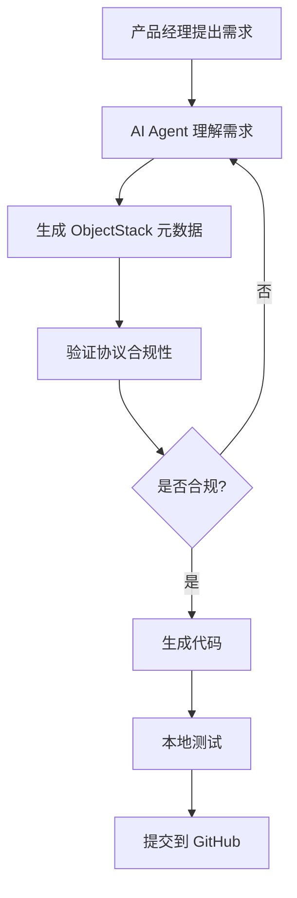

# ObjectStack 云端管理工具深度设计报告

> **版本**: v1.0  
> **日期**: 2026年2月  
> **作者**: ObjectStack 架构团队  
> **状态**: 设计草案

---

## 📋 执行摘要

ObjectStack 是新一代元数据驱动的企业管理软件平台框架，致力于打造"后 SaaS 时代操作系统"。本报告基于对现有 128 个 Zod 协议规范的全面分析，结合 AI 开发对企业管理软件领域带来的革命性变化，提出了一套完整的云端管理工具架构设计方案。

该方案充分利用 GitHub、Vercel 等现代云服务，构建了从开发、测试、部署到运维的全生命周期自动化管理体系，为打造全球最顶流的企业管理软件平台奠定了坚实基础。

### 核心价值主张

1. **AI 优先架构** - 从协议设计层面原生支持 AI Agent 自主开发与运维
2. **云原生基础设施** - 深度集成 GitHub、Vercel 等云服务，零基础设施运维成本
3. **元数据驱动** - 通过 128+ Zod 协议实现完整的类型安全与运行时验证
4. **微内核架构** - 插件化设计支持无限扩展，适应各种企业场景
5. **全球化部署** - 边缘计算与 CDN 加速，为全球用户提供毫秒级响应

---

## 🎯 战略定位

### 市场机遇分析

**传统企业管理软件的困境：**
- 高昂的定制开发成本（每人月 5-15 万人民币）
- 漫长的实施周期（6-18 个月）
- 难以维护的代码库（技术债务累积）
- 供应商锁定（迁移成本极高）

**AI 时代的机遇：**
- **AI Agent 自主开发** - 从需求到代码的自动化生成，开发效率提升 10-100 倍
- **自然语言编程** - 业务人员可直接用中文描述需求，AI 自动生成应用
- **智能运维** - 自动发现问题、自我修复、持续优化
- **知识复用** - 基于 RAG 的最佳实践自动推荐

**ObjectStack 的差异化优势：**
1. **协议优先** - 128+ Zod 协议是"宪法"，所有实现必须遵守
2. **开源开放** - Apache 2.0 许可，避免供应商锁定
3. **AI 原生** - 从第一天就为 AI 开发设计（Agent、RAG、NLQ 等完整协议）
4. **云优先** - 无需自建基础设施，充分利用 GitHub/Vercel 生态

---

## 🏗️ 架构全景图

### 三层协议栈

```
┌─────────────────────────────────────────────────────────────────┐
│                    Layer 3: ObjectUI (视图层)                    │
│  ┌───────────────────────────────────────────────────────────┐  │
│  │  • App (应用导航)     • Dashboard (仪表板)                 │  │
│  │  • View (视图配置)    • Report (报表)                      │  │
│  │  • Action (动作按钮)  • Widget (小部件)                    │  │
│  │  • Chart (图表)       • Theme (主题)                       │  │
│  └───────────────────────────────────────────────────────────┘  │
│  协议文件: ui/*.zod.ts (9 个协议)                               │
└─────────────────────────────┬───────────────────────────────────┘
                              │ REST API / GraphQL / WebSocket
┌─────────────────────────────▼───────────────────────────────────┐
│                   Layer 2: ObjectOS (控制层)                     │
│  ┌───────────────────────────────────────────────────────────┐  │
│  │  • Auth (认证授权)     • Workflow (工作流)                 │  │
│  │  • Permission (权限)   • Approval (审批)                   │  │
│  │  • Job (作业调度)      • Event (事件总线)                  │  │
│  │  • Audit (审计日志)    • Notification (通知)               │  │
│  │  • Cache (缓存)        • Tracing (链路追踪)                │  │
│  └───────────────────────────────────────────────────────────┘  │
│  协议文件: system/*.zod.ts (34 个协议) + auth/*.zod.ts (6 个)   │
└─────────────────────────────┬───────────────────────────────────┘
                              │ ObjectQL Protocol
┌─────────────────────────────▼───────────────────────────────────┐
│                   Layer 1: ObjectQL (数据层)                     │
│  ┌───────────────────────────────────────────────────────────┐  │
│  │  • Object (对象定义)   • Query (查询构建器)                │  │
│  │  • Field (字段)        • Filter (过滤器)                   │  │
│  │  • Validation (验证)   • Driver (驱动适配器)               │  │
│  │  • Hook (生命周期钩子) • Mapping (数据映射)                │  │
│  └───────────────────────────────────────────────────────────┘  │
│  协议文件: data/*.zod.ts (12 个协议)                            │
└─────────────────────────────────────────────────────────────────┘

┌─────────────────────────────────────────────────────────────────┐
│                      横切关注点 (Cross-Cutting)                  │
│  ┌───────────────────────────────────────────────────────────┐  │
│  │  AI Protocol (13):      Agent, RAG, NLQ, DevOps Agent...  │  │
│  │  API Protocol (13):     REST, GraphQL, OData, WebSocket...│  │
│  │  Integration (7):       GitHub, Vercel, Database, SaaS... │  │
│  │  Hub (9):               Marketplace, Plugin, License...   │  │
│  │  Automation (7):        Flow, ETL, Webhook, Sync...       │  │
│  │  QA (1):                Testing                           │  │
│  └───────────────────────────────────────────────────────────┘  │
└─────────────────────────────────────────────────────────────────┘
```

### 现有协议清单（128 个）

| 类别 | 协议数量 | 核心协议 | 说明 |
|-----|---------|---------|------|
| **AI** | 13 | agent, rag-pipeline, devops-agent, nlq, plugin-development | AI 驱动开发的完整生态 |
| **API** | 13 | contract, endpoint, registry, graphql, odata, websocket | 多协议 API 支持 |
| **Auth** | 6 | identity, role, policy, organization, scim | 企业级身份管理 |
| **Automation** | 7 | flow, workflow, approval, etl, webhook | 业务流程自动化 |
| **Data** | 12 | object, field, query, filter, validation, driver | 统一数据抽象 |
| **Hub** | 9 | marketplace, plugin-registry, license, tenant, space | 插件生态系统 |
| **Integration** | 7 | connector, github, vercel, database, saas | 外部系统集成 |
| **Permission** | 4 | permission, rls, sharing, territory | 精细化权限控制 |
| **QA** | 1 | testing | 自动化测试 |
| **System** | 34 | manifest, plugin, datasource, cache, logging, metrics | 系统核心能力 |
| **UI** | 9 | app, view, dashboard, report, action, chart | 用户界面协议 |
| **Shared** | 3 | http, identifiers, mapping | 通用工具 |
| **Contracts** | 1 | - | 契约管理 |
| **Stack** | 1 | stack | 应用栈定义 |

---

## 🤖 AI 驱动的云端管理架构

### 核心理念：AI Agent 作为一等公民

ObjectStack 的革命性创新在于将 AI Agent 视为平台的**一等公民**，而非事后添加的辅助功能。这体现在以下方面：

#### 1. DevOps Agent - 自主开发与运维

**协议定义**: `packages/spec/src/ai/devops-agent.zod.ts`

```typescript
// DevOps Agent 可以：
✓ 根据 ObjectStack 协议自动生成代码
✓ 自主创建 GitHub Pull Request
✓ 自动触发 Vercel 部署
✓ 监控应用性能并自我优化
✓ 发现问题后自动回滚或修复
```

**工作流程：**

```
需求输入 (中文/自然语言)
    ↓
DevOps Agent 理解需求
    ↓
生成 ObjectStack 元数据配置
    ↓
验证协议合规性 (Zod Schema)
    ↓
生成代码 (TypeScript/React)
    ↓
创建 GitHub PR
    ↓
CI/CD 自动测试
    ↓
Vercel 部署预览环境
    ↓
人工审核 (可选)
    ↓
自动合并 & 部署生产环境
```

#### 2. Plugin Development Agent - 生态系统扩展

**协议定义**: `packages/spec/src/ai/plugin-development.zod.ts`

AI Agent 可以自动生成插件：
- 读取 Marketplace 需求
- 生成插件脚手架
- 实现核心功能
- 编写测试用例
- 生成文档
- 发布到 NPM + Marketplace

#### 3. RAG Pipeline - 知识驱动

**协议定义**: `packages/spec/src/ai/rag-pipeline.zod.ts`

建立企业管理软件的知识库：
- **代码库索引** - 所有 ObjectStack 协议、示例代码
- **最佳实践库** - Salesforce、ServiceNow 等顶级平台的设计模式
- **行业知识库** - CRM、ERP、HRM 等领域知识
- **历史问题库** - 过往问题与解决方案

```typescript
{
  indexes: [
    'objectstack-spec-v1',        // 协议规范
    'enterprise-patterns',         // 企业模式
    'salesforce-best-practices',   // 最佳实践
    'stackoverflow-objectstack'    // 社区问答
  ],
  sources: [
    { type: 'github', repo: 'objectstack-ai/spec' },
    { type: 'documentation', url: 'docs.objectstack.ai' },
    { type: 'community', url: 'community.objectstack.ai' }
  ]
}
```

---

## ☁️ 云服务集成架构

### GitHub 深度集成

**协议定义**: `packages/spec/src/integration/connector/github.zod.ts`

#### 核心能力

1. **版本控制自动化**
   ```yaml
   功能矩阵:
   ✓ 自动创建分支 (feature/, bugfix/, hotfix/)
   ✓ 自动提交代码 (Conventional Commits 格式)
   ✓ 自动创建 Pull Request
   ✓ 自动合并 (Auto-merge with required checks)
   ✓ 分支保护规则 (Branch Protection)
   ```

2. **GitHub Actions 工作流**
   ```yaml
   CI/CD Pipeline:
   - 代码检查: ESLint, TypeScript, Prettier
   - 单元测试: Vitest (80%+ 覆盖率)
   - 集成测试: Playwright E2E
   - 构建验证: pnpm build --filter @objectstack/*
   - 安全扫描: CodeQL, Dependabot
   - 协议验证: Zod Schema 合规性检查
   ```

3. **Release 管理**
   ```yaml
   发布流程:
   - 语义化版本: v1.2.3 (Semantic Versioning)
   - 自动生成 Changelog (Conventional Commits)
   - 自动创建 GitHub Release
   - 自动发布 NPM Packages
   - 自动更新文档站点
   ```

4. **Issue & Project 管理**
   ```yaml
   自动化任务:
   - Issue 自动打标签 (AI 分类)
   - 自动分配给相关 Agent
   - 自动创建关联 Task
   - Stale Issue 自动关闭 (60 天无活动)
   ```

#### GitHub Connector 配置示例

```typescript
{
  name: 'github_production',
  provider: 'github',
  baseUrl: 'https://api.github.com',
  
  repositories: [
    {
      owner: 'objectstack-ai',
      name: 'spec',
      defaultBranch: 'main',
      branchProtection: {
        requiredReviewers: 1,
        requireStatusChecks: true,
        enforceAdmins: false
      }
    }
  ],
  
  commitConfig: {
    authorName: 'ObjectStack Bot',
    authorEmail: 'bot@objectstack.ai',
    useConventionalCommits: true  // feat:, fix:, docs:
  },
  
  pullRequestConfig: {
    titleTemplate: '{{type}}: {{description}}',
    defaultReviewers: ['ai-agent', 'tech-lead'],
    defaultLabels: ['ai-generated', 'auto-deploy'],
    deleteHeadBranch: true  // 合并后自动删除分支
  },
  
  workflows: [
    {
      name: 'CI',
      path: '.github/workflows/ci.yml',
      triggers: ['push', 'pull_request']
    },
    {
      name: 'CD',
      path: '.github/workflows/cd.yml',
      triggers: ['release']
    }
  ],
  
  webhookEvents: [
    'push',
    'pull_request',
    'release',
    'workflow_run'
  ]
}
```

---

### Vercel 深度集成

**协议定义**: `packages/spec/src/integration/connector/vercel.zod.ts`

#### 核心能力

1. **全球边缘部署**
   ```yaml
   部署策略:
   ✓ Production: 多区域部署 (美东/美西/欧洲/亚太)
   ✓ Preview: 每个 PR 自动部署预览环境
   ✓ Development: 本地开发环境镜像
   
   区域分布:
   - iad1 (US East - Washington DC)
   - sfo1 (US West - San Francisco)
   - fra1 (Europe - Frankfurt)
   - sin1 (Asia - Singapore)
   - hnd1 (Asia - Tokyo)
   ```

2. **自动化部署流程**
   ```yaml
   触发条件:
   - Push to main → 生产环境部署
   - Pull Request → 预览环境部署
   - Release Tag → 正式发布
   
   部署步骤:
   1. Git Push 触发 Vercel Webhook
   2. 自动安装依赖 (pnpm install)
   3. 构建应用 (Next.js Build)
   4. 边缘优化 (Image/Font Optimization)
   5. 部署到 Edge Network
   6. 健康检查 (Health Check)
   7. 流量切换 (Zero Downtime)
   ```

3. **环境变量管理**
   ```typescript
   {
     environmentVariables: [
       {
         key: 'DATABASE_URL',
         value: '${DATABASE_URL}',
         target: ['production', 'preview'],
         isSecret: true
       },
       {
         key: 'NEXT_PUBLIC_API_URL',
         value: 'https://api.objectstack.ai',
         target: ['production']
       }
     ]
   }
   ```

4. **监控与分析**
   ```yaml
   内置服务:
   ✓ Vercel Analytics - 实时用户访问分析
   ✓ Speed Insights - 性能指标监控
   ✓ Log Drains - 日志流式传输 (Datadog/NewRelic)
   ✓ Edge Caching - CDN 缓存优化
   ```

#### Vercel Connector 配置示例

```typescript
{
  name: 'vercel_production',
  provider: 'vercel',
  
  projects: [
    {
      name: 'objectstack-app',
      framework: 'nextjs',
      
      gitRepository: {
        type: 'github',
        repo: 'objectstack-ai/app',
        productionBranch: 'main',
        autoDeployProduction: true,
        autoDeployPreview: true
      },
      
      buildConfig: {
        buildCommand: 'pnpm run build',
        outputDirectory: '.next',
        nodeVersion: '20.x',
        env: {
          NEXT_PUBLIC_API_URL: 'https://api.objectstack.ai'
        }
      },
      
      deploymentConfig: {
        regions: ['iad1', 'sfo1', 'fra1', 'sin1'],
        enablePreview: true,
        previewComments: true,  // 在 PR 中评论预览链接
        productionProtection: true  // 生产部署需要审批
      },
      
      domains: [
        {
          domain: 'app.objectstack.ai',
          httpsRedirect: true,
          gitBranch: 'main'
        },
        {
          domain: 'staging.objectstack.ai',
          gitBranch: 'develop'
        }
      ],
      
      edgeFunctions: [
        {
          name: 'api-middleware',
          path: '/api/*',
          regions: ['iad1', 'sfo1'],
          timeout: 10
        }
      ]
    }
  ],
  
  monitoring: {
    enableWebAnalytics: true,
    enableSpeedInsights: true,
    logDrains: [
      {
        name: 'datadog',
        url: 'https://http-intake.logs.datadoghq.com',
        sources: ['lambda', 'edge']
      }
    ]
  }
}
```

---

## 🔄 完整的 DevOps 工作流

### 开发阶段



**自动化工具：**
- **需求分析 Agent** - 将自然语言需求转换为规范化的对象定义
- **代码生成 Agent** - 基于元数据生成 TypeScript/React 代码
- **测试生成 Agent** - 自动生成单元测试和集成测试

### 测试阶段

```yaml
本地测试 (pnpm test):
  - 单元测试: Vitest
  - 类型检查: TypeScript tsc --noEmit
  - 代码规范: ESLint + Prettier
  - 协议验证: Zod Schema Parse

CI 测试 (GitHub Actions):
  - 多环境测试: Node 18/20/22
  - 浏览器测试: Chrome/Firefox/Safari
  - 集成测试: Playwright E2E
  - 安全扫描: CodeQL
  - 依赖审计: npm audit
  - License 检查: license-checker

预览环境测试 (Vercel):
  - 自动部署预览环境
  - 冒烟测试 (Smoke Test)
  - 性能测试 (Lighthouse CI)
  - 可用性测试 (User Acceptance Test)
```

### 部署阶段

```yaml
部署策略:
  灰度发布 (Canary Deployment):
    - 5% 流量 → 新版本
    - 监控错误率/性能
    - 无异常 → 逐步扩大到 100%
    - 发现问题 → 立即回滚

  蓝绿部署 (Blue-Green Deployment):
    - 部署新版本 (Green)
    - 旧版本继续服务 (Blue)
    - 验证新版本正常
    - 流量切换到 Green
    - 保留 Blue 用于快速回滚

  区域部署 (Regional Rollout):
    - 亚太区 → 欧洲区 → 美洲区
    - 分时段部署，降低风险
```

### 监控阶段

```yaml
实时监控指标:
  性能指标:
    - 响应时间 (P50/P95/P99)
    - 吞吐量 (RPS)
    - 错误率 (Error Rate)
    - 可用性 (Uptime)

  业务指标:
    - 用户活跃度 (DAU/MAU)
    - 功能使用率
    - 转化率
    - 客户满意度 (NPS)

  资源指标:
    - CPU 使用率
    - 内存使用率
    - 带宽消耗
    - 存储容量

告警机制:
  - 错误率 > 1% → 发送告警
  - 响应时间 P95 > 1s → 发送告警
  - 可用性 < 99.9% → 紧急告警
  - 自动回滚触发条件
```

---

## 🎨 用户体验设计

### 云端管理控制台架构

#### 1. 统一的管理界面

```typescript
// App 导航结构 (packages/spec/src/ui/app.zod.ts)
{
  name: 'objectstack_console',
  label: 'ObjectStack 云端控制台',
  
  navigation: [
    {
      type: 'group',
      label: '工作台',
      items: [
        { type: 'dashboard', target: 'overview' },
        { type: 'object', target: 'my_apps' },
        { type: 'object', target: 'recent_activities' }
      ]
    },
    {
      type: 'group',
      label: '开发',
      items: [
        { type: 'object', target: 'project' },
        { type: 'object', target: 'deployment' },
        { type: 'object', target: 'github_integration' },
        { type: 'object', target: 'vercel_integration' }
      ]
    },
    {
      type: 'group',
      label: 'AI 助手',
      items: [
        { type: 'custom', label: 'DevOps Agent', path: '/ai/devops' },
        { type: 'custom', label: '代码生成', path: '/ai/codegen' },
        { type: 'custom', label: '智能问答', path: '/ai/chat' }
      ]
    },
    {
      type: 'group',
      label: '监控',
      items: [
        { type: 'dashboard', target: 'performance' },
        { type: 'dashboard', target: 'errors' },
        { type: 'report', target: 'usage_report' }
      ]
    },
    {
      type: 'group',
      label: '设置',
      items: [
        { type: 'object', target: 'connector' },
        { type: 'object', target: 'environment_variable' },
        { type: 'object', target: 'team_member' }
      ]
    }
  ],
  
  branding: {
    logo: '/assets/logo.svg',
    primaryColor: '#0066FF',
    theme: 'dark'  // 开发者工具默认暗色主题
  }
}
```

#### 2. 实时协作功能

```yaml
协作特性:
  - 多人同时编辑元数据 (CRDT 冲突解决)
  - 实时代码预览 (WebSocket)
  - 评论与讨论 (类似 Figma)
  - 变更历史追踪 (Git-like)
  - @提及通知
```

#### 3. 智能辅助界面

```yaml
AI 辅助功能:
  - 智能补全: 输入对象名称时推荐字段
  - 错误诊断: 实时检查配置错误并给出修复建议
  - 最佳实践推荐: 基于 RAG 推荐优化方案
  - 自然语言查询: "显示过去7天部署失败的项目"
  - 代码生成快捷方式: "创建一个 CRM 客户对象"
```

---

## 📊 数据架构与存储策略

### 元数据存储

```yaml
元数据层级:
  1. 协议定义 (Protocol):
     - 存储: GitHub Repository (objectstack-ai/spec)
     - 格式: TypeScript + Zod Schema
     - 版本: Git Tags (v1.0.0, v2.0.0)
     - 发布: NPM Package (@objectstack/spec)

  2. 应用配置 (Application):
     - 存储: GitHub Repository (用户私有仓库)
     - 格式: TypeScript (objectstack.config.ts)
     - 版本: Git Commits
     - 部署: Vercel (自动同步)

  3. 运行时数据 (Runtime):
     - 存储: 用户选择的数据源
     - 支持: PostgreSQL, MongoDB, Redis, SQLite
     - 驱动: Driver Plugins
```

### 多租户架构

```yaml
租户隔离策略:
  数据隔离:
    - Schema 隔离: 每个租户独立 Schema
    - Database 隔离: 高价值客户独立数据库
    - Cluster 隔离: 超大租户独立集群

  资源隔离:
    - Vercel Project: 每个租户独立 Project
    - GitHub Repo: 企业版可用私有仓库
    - Edge Function: 按租户分配资源配额

  安全隔离:
    - API Key: 租户级别密钥
    - Webhook Secret: 独立签名密钥
    - Encryption Key: 独立加密密钥
```

---

## 🔐 安全架构

### 认证与授权

```yaml
认证方式:
  - OAuth 2.0 / OIDC (Google, GitHub, Microsoft)
  - SAML 2.0 (企业级 SSO)
  - API Key (服务间调用)
  - JWT Token (无状态会话)

授权模型:
  - RBAC (Role-Based Access Control)
  - ABAC (Attribute-Based Access Control)
  - RLS (Row-Level Security)
  - Territory Management (地域权限)
```

**协议支持**:
- `auth/identity.zod.ts` - 身份认证
- `auth/role.zod.ts` - 角色定义
- `auth/policy.zod.ts` - 权限策略
- `auth/organization.zod.ts` - 组织架构
- `permission/permission.zod.ts` - 权限控制
- `permission/rls.zod.ts` - 行级安全

### 数据安全

```yaml
加密策略:
  传输层加密:
    - HTTPS/TLS 1.3 (所有通信)
    - WSS (WebSocket Secure)
    - mTLS (服务间通信)

  存储层加密:
    - AES-256 (敏感字段加密)
    - Transparent Data Encryption (数据库级)
    - Key Management Service (密钥管理)

  应用层安全:
    - XSS 防护 (Content Security Policy)
    - CSRF 防护 (Token 验证)
    - SQL 注入防护 (参数化查询)
    - Rate Limiting (接口限流)
```

**协议支持**:
- `system/encryption.zod.ts` - 加密配置
- `system/masking.zod.ts` - 数据脱敏
- `system/compliance.zod.ts` - 合规性管理

---

## 🚀 扩展性设计

### 插件市场架构

```yaml
Marketplace 组成:
  1. 插件仓库:
     - NPM Registry (公共插件)
     - Private Registry (企业私有插件)
     - GitHub Packages (开源插件)

  2. 插件类型:
     - Driver Plugins: 数据源驱动
     - App Plugins: 业务应用
     - Integration Plugins: 外部集成
     - UI Plugins: 界面组件
     - AI Plugins: AI 能力扩展

  3. 质量保证:
     - 自动化测试 (必需 80%+ 覆盖率)
     - 代码审查 (AI + 人工)
     - 安全扫描 (CodeQL + Snyk)
     - 性能评估 (Lighthouse)
     - License 合规性检查
```

**协议支持**:
- `hub/marketplace.zod.ts` - 插件市场
- `hub/plugin-registry.zod.ts` - 插件注册
- `hub/plugin-security.zod.ts` - 插件安全
- `hub/license.zod.ts` - 许可证管理

### API 生态系统

```yaml
API 协议支持:
  ✓ REST API (OpenAPI 3.1)
  ✓ GraphQL (Schema Stitching)
  ✓ OData v4 (Excel/Power BI 集成)
  ✓ WebSocket (实时通信)
  ✓ gRPC (高性能 RPC)
  ✓ Server-Sent Events (单向推送)

API 管理:
  - API Gateway (路由与聚合)
  - Rate Limiting (限流保护)
  - API Versioning (版本管理)
  - API Documentation (自动生成)
  - API Analytics (使用分析)
```

**协议支持** (13 个 API 协议):
- `api/contract.zod.ts` - API 契约
- `api/endpoint.zod.ts` - 端点定义
- `api/registry.zod.ts` - API 注册中心
- `api/graphql.zod.ts` - GraphQL 支持
- `api/odata.zod.ts` - OData 支持
- `api/websocket.zod.ts` - WebSocket 支持

---

## 💡 创新特性

### 1. 无代码 AI 应用开发

```yaml
用户体验流程:
  1. 用户: "我要创建一个客户关系管理系统"
  2. AI Agent: 理解需求，提出问题
     - "需要管理哪些类型的客户？"
     - "需要什么样的销售流程？"
     - "团队有多少人使用？"
  3. AI Agent: 生成应用定义
  4. 预览: 用户实时预览应用界面
  5. 确认: 一键部署到生产环境

技术实现:
  - NLQ (Natural Language Query) 协议
  - Agent Orchestration
  - RAG Pipeline (最佳实践检索)
  - Code Generation
  - Auto Deployment
```

### 2. 智能运维 (AIOps)

```yaml
自动化运维能力:
  问题检测:
    - 异常检测: 基于机器学习的异常模式识别
    - 根因分析: 自动追踪问题根源
    - 影响评估: 评估问题影响范围

  自动修复:
    - 自动回滚: 检测到问题立即回滚
    - 自动扩容: 负载过高自动扩展资源
    - 自动优化: SQL 查询优化、缓存策略调整

  预测性维护:
    - 容量规划: 预测资源需求
    - 故障预测: 提前发现潜在问题
    - 性能优化: 主动优化系统性能
```

**协议支持**:
- `ai/runtime-ops.zod.ts` - 运行时运维
- `ai/predictive.zod.ts` - 预测分析
- `ai/feedback-loop.zod.ts` - 反馈闭环

### 3. 可视化低代码开发

```yaml
Visual Builder 功能:
  - 拖拽式对象设计器
  - 可视化流程编排
  - 实时代码预览
  - 所见即所得的界面设计
  - 自动生成 API 文档
```

**协议支持**:
- `automation/flow.zod.ts` - 流程编排
- `ui/component.zod.ts` - UI 组件
- `ui/page.zod.ts` - 页面配置

---

## 📈 性能优化策略

### 前端性能

```yaml
优化措施:
  构建优化:
    - Tree Shaking (移除未使用代码)
    - Code Splitting (按需加载)
    - Bundle Analysis (包体积分析)
    - Minification (代码压缩)

  运行时优化:
    - React Server Components
    - Streaming SSR (流式渲染)
    - Incremental Static Regeneration
    - Client-side Caching (SWR/React Query)

  资源优化:
    - Image Optimization (WebP/AVIF)
    - Font Optimization (Variable Fonts)
    - CDN 加速 (Vercel Edge Network)
    - Brotli 压缩

  监控指标:
    - Core Web Vitals (LCP, FID, CLS)
    - Time to Interactive (TTI)
    - First Contentful Paint (FCP)
    - Lighthouse Score > 90
```

### 后端性能

```yaml
优化措施:
  查询优化:
    - Query Plan 分析
    - 索引优化
    - N+1 查询检测
    - Database Connection Pooling

  缓存策略:
    - Redis 缓存 (热数据)
    - CDN 缓存 (静态资源)
    - HTTP 缓存 (ETag/Cache-Control)
    - GraphQL 查询缓存

  并发处理:
    - Edge Functions (边缘计算)
    - Serverless (自动扩展)
    - Queue (异步任务队列)
    - Rate Limiting (限流保护)
```

**协议支持**:
- `system/cache.zod.ts` - 缓存配置
- `system/metrics.zod.ts` - 性能指标
- `api/http-cache.zod.ts` - HTTP 缓存

---

## 🌍 全球化与国际化

### 多语言支持

```yaml
i18n 架构:
  协议定义: system/translation.zod.ts
  
  支持语言:
    - 中文 (简体/繁体)
    - 英语
    - 日语
    - 韩语
    - 西班牙语
    - 法语
    - 德语

  翻译管理:
    - 翻译存储: JSON/YAML
    - 翻译平台: Crowdin/Lokalise
    - 自动翻译: AI 辅助翻译
    - 翻译验证: 语法检查
```

### 全球部署

```yaml
边缘节点分布:
  北美:
    - 华盛顿特区 (iad1)
    - 旧金山 (sfo1)
  
  欧洲:
    - 法兰克福 (fra1)
    - 伦敦 (lhr1)
  
  亚太:
    - 新加坡 (sin1)
    - 东京 (hnd1)
    - 首尔 (icn1)
    - 悉尼 (syd1)
  
  南美:
    - 圣保罗 (gru1)

智能路由:
  - GeoDNS (地理位置路由)
  - Latency-based Routing (延迟路由)
  - Failover (故障转移)
  - Health Check (健康检查)
```

---

## 💰 成本优化

### 云服务成本分析

```yaml
GitHub:
  免费额度:
    - 公共仓库: 无限
    - GitHub Actions: 2000 分钟/月
    - GitHub Packages: 500 MB
  
  付费方案:
    - Team: $4/用户/月
    - Enterprise: $21/用户/月

Vercel:
  免费额度 (Hobby):
    - 带宽: 100 GB/月
    - Serverless Function: 100 GB-小时
    - Edge Function: 100K 请求
    - Build 时间: 6000 分钟/月
  
  付费方案 (Pro):
    - $20/用户/月
    - 带宽: 1 TB/月
    - 无限构建时间
    - 高级分析

成本优化策略:
  1. 使用免费额度:
     - 开源项目完全免费
     - 小型应用在免费额度内运行
  
  2. 按需付费:
     - 只为实际使用付费
     - 无闲置资源成本
  
  3. 缓存优化:
     - 减少 Serverless 调用
     - CDN 缓存降低带宽
  
  4. 批量操作:
     - 批量 API 调用
     - 批量数据库查询
```

---

## 🎯 实施路线图

### Phase 1: 基础设施 (Q1 2026)

```yaml
目标: 搭建核心云端管理平台

里程碑:
  ✓ GitHub 集成完成
    - Repository 管理
    - CI/CD Pipeline
    - Issue 管理
  
  ✓ Vercel 集成完成
    - 自动部署
    - 环境管理
    - 监控告警
  
  ✓ 基础 AI Agent
    - DevOps Agent (基础版)
    - Code Review Agent
    - Documentation Agent

交付物:
  - GitHub Connector 实现
  - Vercel Connector 实现
  - 云端控制台 v1.0
  - 开发者文档
```

### Phase 2: AI 增强 (Q2 2026)

```yaml
目标: 强化 AI 驱动的开发能力

里程碑:
  ✓ NLQ (自然语言查询)
    - 中文支持
    - 上下文理解
    - 多轮对话
  
  ✓ RAG Pipeline
    - 知识库构建
    - 向量索引
    - 语义检索
  
  ✓ Plugin Development Agent
    - 插件脚手架生成
    - 代码自动生成
    - 测试用例生成

交付物:
  - AI 助手控制台
  - 知识库管理系统
  - 插件开发工具包
  - AI 能力 API
```

### Phase 3: 生态建设 (Q3 2026)

```yaml
目标: 建立繁荣的插件生态

里程碑:
  ✓ Marketplace 上线
    - 插件发布流程
    - 插件评分系统
    - 收入分成机制
  
  ✓ 官方插件库
    - 10+ 行业模板
    - 20+ 集成连接器
    - 50+ UI 组件
  
  ✓ 社区建设
    - 开发者论坛
    - 技术博客
    - 视频教程

交付物:
  - Marketplace 平台
  - 官方插件包
  - 开发者社区
  - 认证计划
```

### Phase 4: 企业增强 (Q4 2026)

```yaml
目标: 满足大型企业需求

里程碑:
  ✓ 企业级安全
    - SSO / SAML 2.0
    - 审计日志
    - 合规性认证 (SOC 2, ISO 27001)
  
  ✓ 多租户增强
    - 租户隔离
    - 资源配额
    - 白标定制
  
  ✓ 私有化部署
    - Docker / Kubernetes
    - 私有云支持
    - Air-gapped 环境

交付物:
  - 企业版产品
  - 私有化部署方案
  - SLA 保障
  - 专属支持
```

---

## 📊 关键成功指标 (KPI)

### 技术指标

```yaml
性能:
  - 页面加载时间: < 2 秒
  - API 响应时间: < 200ms (P95)
  - 系统可用性: > 99.9%
  - 错误率: < 0.1%

开发效率:
  - 从需求到上线: < 1 小时
  - 代码覆盖率: > 80%
  - 自动化率: > 90%
  - 部署频率: 每天 10+ 次

用户体验:
  - Lighthouse Score: > 90
  - 首次交互时间: < 1 秒
  - 客户满意度: > 4.5/5
```

### 业务指标

```yaml
用户增长:
  - 月活用户 (MAU): 目标 10,000
  - 付费转化率: > 5%
  - 用户留存率: > 80% (月度)

生态发展:
  - 插件数量: 100+
  - 开发者数量: 1,000+
  - 社区贡献: 500+ PR

收入指标:
  - ARR (年度经常性收入): 目标 $1M
  - ARPU (每用户收入): $100/月
  - CAC (客户获取成本): < $500
```

---

## 🔮 未来展望

### 短期 (6-12 个月)

```yaml
技术演进:
  - 全面 AI 化: 所有功能都有 AI 助手
  - 多模态交互: 语音、图像、视频输入
  - 实时协作: 类 Figma 的实时编辑
  - 移动端优化: PWA + 原生 App

业务拓展:
  - 行业解决方案: CRM, ERP, HRM
  - 地域扩张: 东南亚、欧洲市场
  - 合作伙伴: ISV 合作计划
  - 教育培训: 认证开发者计划
```

### 中期 (1-2 年)

```yaml
平台能力:
  - 低代码/无代码: 完全可视化开发
  - AI Copilot: 贯穿全流程的 AI 助手
  - 联邦学习: 跨组织的 AI 模型训练
  - 区块链集成: 不可篡改的审计日志

生态系统:
  - 行业云: 垂直行业解决方案
  - 应用商店: 类 Salesforce AppExchange
  - 服务市场: 咨询、实施、培训
  - 开源社区: Apache 基金会项目
```

### 长期 (3-5 年)

```yaml
愿景:
  成为企业管理软件的"操作系统":
  - 标准协议: 行业事实标准
  - 开放生态: 百万级开发者
  - 全球化: 支持 50+ 语言
  - 智能化: AGI 级别的自主开发

技术突破:
  - 自进化系统: 系统自我学习优化
  - 量子计算: 复杂问题求解
  - 边缘智能: IoT 设备原生支持
  - 元宇宙集成: 虚拟办公空间
```

---

## 🎓 总结与建议

### 核心优势总结

1. **AI 原生架构** - 从协议层就为 AI 设计，而非后期添加
2. **云原生设计** - 深度集成 GitHub/Vercel，零基础设施成本
3. **开放生态** - 基于开源协议，避免供应商锁定
4. **全球化就绪** - 边缘部署 + 多语言支持
5. **快速迭代** - AI 辅助开发，效率提升 10-100 倍

### 战略建议

#### 技术策略

```yaml
短期 (立即执行):
  1. 完善 GitHub/Vercel Connector 实现
  2. 部署 DevOps Agent 原型
  3. 构建 RAG 知识库
  4. 优化云端控制台体验

中期 (3-6 个月):
  1. 推出 Marketplace 测试版
  2. 发布 10 个官方插件
  3. 建立开发者社区
  4. 完成 SOC 2 认证

长期 (6-12 个月):
  1. 实现完全 AI 驱动的开发流程
  2. 扩展到 5 个垂直行业
  3. 建立全球合作伙伴网络
  4. 成为行业标准协议
```

#### 商业策略

```yaml
定价模式:
  免费版 (Community):
    - 公开项目无限使用
    - GitHub 公共仓库
    - Vercel Hobby 额度
    - 社区支持

  专业版 (Pro): $20/用户/月
    - 私有项目
    - 高级 AI 功能
    - 优先支持
    - 团队协作

  企业版 (Enterprise): 定制报价
    - 私有化部署
    - SSO / SAML
    - SLA 保障
    - 专属客户成功经理

收入来源:
  1. 订阅收入 (70%)
  2. Marketplace 分成 (20%)
  3. 咨询服务 (10%)
```

#### 风险与挑战

```yaml
技术风险:
  - AI 模型成本控制
  - 多租户数据隔离
  - 边缘节点可用性
  - API 限流策略

缓解措施:
  - 使用开源模型降低成本
  - 严格的安全审计
  - 多云备份策略
  - 智能缓存与批处理

市场风险:
  - 竞争对手模仿
  - 客户接受度
  - 合规性要求
  - 技术债务

缓解措施:
  - 快速迭代保持领先
  - 案例研究与客户见证
  - 提前获取认证
  - 持续重构与优化
```

---

## 📚 附录

### A. 参考协议列表

完整的 128 个协议清单已在"架构全景图"章节列出。

关键协议详细说明：

| 协议文件 | 用途 | 优先级 |
|---------|------|--------|
| `integration/connector/github.zod.ts` | GitHub 集成 | P0 |
| `integration/connector/vercel.zod.ts` | Vercel 集成 | P0 |
| `ai/devops-agent.zod.ts` | DevOps 自动化 | P0 |
| `ai/agent.zod.ts` | AI Agent 定义 | P0 |
| `ai/rag-pipeline.zod.ts` | 知识检索 | P1 |
| `hub/marketplace.zod.ts` | 插件市场 | P1 |
| `system/manifest.zod.ts` | 应用清单 | P0 |
| `api/registry.zod.ts` | API 注册 | P0 |

### B. 技术栈清单

```yaml
前端:
  - Next.js 14 (App Router)
  - React 18 (Server Components)
  - TypeScript 5.3
  - Tailwind CSS + Shadcn UI
  - SWR / React Query

后端:
  - Hono (Edge Runtime)
  - Zod (Schema Validation)
  - Pino (Logging)
  - TypeScript 5.3

数据库:
  - PostgreSQL 16 (主数据库)
  - Redis 7 (缓存)
  - Vector DB (向量检索)

基础设施:
  - GitHub (代码托管 + CI/CD)
  - Vercel (部署平台)
  - Cloudflare (DNS + CDN)
  - Datadog (监控)

AI/ML:
  - OpenAI GPT-4
  - Anthropic Claude 3
  - LangChain (Orchestration)
  - Pinecone (Vector Store)
```

### C. 相关资源

```yaml
官方网站:
  - https://objectstack.ai - 主站
  - https://docs.objectstack.ai - 文档
  - https://marketplace.objectstack.ai - 插件市场
  - https://community.objectstack.ai - 社区

代码仓库:
  - https://github.com/objectstack-ai/spec - 协议规范
  - https://github.com/objectstack-ai/core - 核心引擎
  - https://github.com/objectstack-ai/examples - 示例代码

社交媒体:
  - Twitter: @ObjectStackAI
  - Discord: discord.gg/objectstack
  - YouTube: youtube.com/@ObjectStackAI
```

---

## 🙏 致谢

本报告的完成得益于以下资源和灵感：

- **Salesforce** - Platform 设计理念
- **ServiceNow** - 工作流引擎架构
- **Kubernetes** - 声明式配置思想
- **Vercel** - 开发者体验标准
- **GitHub** - 协作开发最佳实践
- **OpenAI** - AI 能力赋能

---

**报告编制人**: ObjectStack 架构团队  
**最后更新**: 2026年2月3日  
**版本**: 1.0.0  
**状态**: 供内部讨论与决策参考

---

*本报告中的所有设计方案、技术选型和战略规划均基于对现有 ObjectStack 协议规范的深入分析，以及对企业管理软件行业发展趋势的研判。具体实施时可根据实际情况调整。*