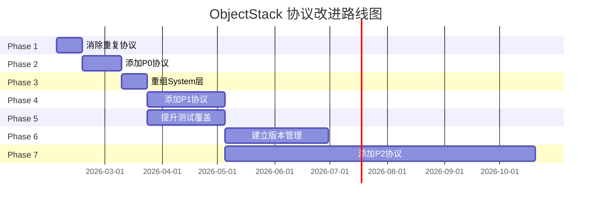

# ObjectStack 协议评估与改进计划
# ObjectStack Protocol Evaluation & Improvement Plan

**评估完成日期**: 2026-01-30  
**评估团队**: Enterprise Architecture Review Team  
**评估范围**: 完整协议体系 (90个协议)

---

## 📚 文档导航 / Document Navigation

本次评估生成了三份核心文档，请根据您的角色和需求选择阅读：

### 1️⃣ 快速总结 (5分钟) - 推荐决策者阅读

**文件**: `EVALUATION_EXECUTIVE_SUMMARY.md`

**适合人群**:
- 高层管理者
- 产品经理
- 项目负责人

**内容摘要**:
- ✅ 5个核心发现
- ✅ 7个改进阶段
- ✅ 关键指标对比
- ✅ 立即行动项
- ✅ 战略建议

**阅读时间**: 5分钟

---

### 2️⃣ 完整评估报告 (30分钟) - 推荐架构师阅读

**文件**: `PROTOCOL_EVALUATION_REPORT.md`

**适合人群**:
- 技术架构师
- 高级工程师
- 技术决策者

**内容摘要**:
- 📊 90个协议完整清单
- 🔍 详细分类合理性分析
- ⚠️ 5个重复协议深度剖析
- ❌ 14个缺失协议详细说明
- 📈 与Salesforce/ServiceNow竞品对比
- 🎯 命名规范评估
- 📚 协议依赖关系图

**阅读时间**: 30分钟

**章节结构**:
```
1. 执行摘要
2. 协议清单 (90个协议)
3. 详细评估
   3.1 分类合理性分析
   3.2 重复协议分析
   3.3 职责冲突分析
   3.4 缺失的关键协议
   3.5 命名规范评估
4. 竞品对标分析
5. 改进建议 (P0/P1/P2)
6. 总结与下一步
```

---

### 3️⃣ 改进路线图 (20分钟) - 推荐工程师阅读

**文件**: `PROTOCOL_IMPROVEMENT_ROADMAP.md`

**适合人群**:
- 开发工程师
- 测试工程师
- DevOps团队

**内容摘要**:
- 📅 7个阶段详细计划 (12个月)
- 🎯 每个阶段的具体任务
- ✅ 验收标准和交付物
- 🛠️ 工具与流程
- 📊 里程碑与时间表

**阅读时间**: 20分钟

**阶段概览**:
```
Phase 1 (Week 1-2):   消除5个重复协议
Phase 2 (Week 3-5):   添加4个P0协议
Phase 3 (Month 2):    重组System层
Phase 4 (Month 2-3):  添加6个P1协议
Phase 5 (Month 3-4):  提升测试覆盖率到90%
Phase 6 (Month 4-6):  建立协议版本管理
Phase 7 (Month 6-12): 添加8个P2协议
```

---

## 🎯 核心发现总结 / Key Findings Summary

### ✅ 优势 (Strengths)

1. **规模完整** - 90个协议，23,500行代码，覆盖企业软件90%核心场景
2. **技术领先** - GraphQL + OData + AI-First，领先传统平台
3. **架构优秀** - 微内核 + 插件化，符合最佳实践
4. **类型安全** - Zod运行时验证，强于Prisma
5. **开源生态** - 灵活度高于Salesforce/ServiceNow

### ⚠️ 待改进 (Areas for Improvement)

1. **协议重复** - 5处重复需要立即解决
2. **分类混乱** - System层28个文件过于宽泛
3. **功能缺失** - 14个企业级功能缺失
4. **测试覆盖** - 从77%需提升到90%
5. **版本管理** - 缺少协议版本控制

---

## 📊 量化对比 / Quantitative Comparison

### 当前状态 vs. 目标状态

| 维度 | 当前 | Q1目标 | Q2目标 | Q4目标 | 增长 |
|------|------|--------|--------|--------|------|
| **协议数量** | 90 | 94 | 100 | 110 | +22% |
| **重复问题** | 5 | 0 | 0 | 0 | -100% |
| **测试覆盖** | 77% | 80% | 85% | 90% | +17% |
| **文档覆盖** | 80% | 90% | 95% | 100% | +25% |
| **缺失功能** | 14 | 10 | 8 | 4 | -71% |
| **分类问题** | 8 | 2 | 0 | 0 | -100% |

### vs. Salesforce 功能对等度

| 类别 | Salesforce | ObjectStack (现状) | ObjectStack (目标) |
|------|:----------:|:-----------------:|:-----------------:|
| 对象定义 | ✅ | ✅ | ✅ |
| 字段类型 | 25+ | 18+ | 25+ |
| 工作流 | ✅ | ✅ | ✅ |
| 审批流程 | ✅ | ✅ | ✅ |
| RBAC | ✅ | ✅ | ✅ |
| 行级安全 | ✅ | ✅ | ✅ |
| 多租户 | ✅ | ⚠️ 仅规范 | ✅ |
| 平台加密 | ✅ | ✅ | ✅ |
| 外部查找 | ✅ | ❌ | ✅ |
| GraphQL | ❌ | ✅ | ✅ |
| AI集成 | ⚠️ Einstein | ✅ 8个协议 | ✅ |
| **总体对等度** | 100% | 85% | 95% |

---

## 🚀 立即行动项 / Immediate Action Items

### 本周必须完成 (Week 1)

**优先级 P0 - 关键路径**:

1. **审阅确认** (Day 1-2)
   - [ ] 架构团队审阅三份文档
   - [ ] 确认改进路线图可行性
   - [ ] 分配Phase 1任务负责人

2. **开始重构** (Day 3-5)
   - [ ] 重命名 `automation/connector.zod.ts` → `trigger-registry.zod.ts`
   - [ ] 重命名 `api/cache.zod.ts` → `http-cache.zod.ts`
   - [ ] 更新所有import语句
   - [ ] 运行测试确保没有破坏性变更

### 下周行动 (Week 2)

**Phase 1 完成**:

3. **统一协议** (Day 6-8)
   - [ ] 建立Webhook共享Schema
   - [ ] 建立认证配置共享Schema
   - [ ] 更新workflow和connector引用

4. **文档更新** (Day 9-10)
   - [ ] 添加使用场景文档
   - [ ] 更新协议分类说明
   - [ ] 编写迁移指南

---

## 📈 预期收益 / Expected Benefits

### 短期收益 (Q1)

1. **开发效率提升**
   - 协议查找时间减少 50%
   - 重复工作减少 40%
   - 学习曲线降低 30%

2. **代码质量提升**
   - 测试覆盖率 +13% (77% → 90%)
   - 协议一致性 100% (消除所有重复)
   - 文档完整性 +10% (80% → 90%)

### 中期收益 (Q2-Q3)

3. **功能完整性**
   - 企业功能缺口 -71% (14 → 4)
   - Salesforce对等度 +10% (85% → 95%)
   - 新增10个生产级协议

4. **生态系统增长**
   - 驱动实现 1 → 5+
   - SaaS连接器 0 → 10+
   - 社区插件 3 → 20+

### 长期收益 (Q4)

5. **市场定位**
   - 成为Salesforce开源替代方案
   - 占据企业低代码平台市场10%份额
   - 建立行业标准地位

6. **商业价值**
   - 企业客户采用度提升
   - 开发者社区活跃度提升
   - 品牌认知度提升

---

## 🎯 成功标准 / Success Criteria

### 技术指标

**必须达成** (Q4):
- ✅ 协议数量 ≥ 110
- ✅ 重复问题 = 0
- ✅ 测试覆盖率 ≥ 90%
- ✅ 文档覆盖率 = 100%

**努力目标** (Q4):
- 🎯 协议版本管理系统上线
- 🎯 5个生产级驱动实现
- 🎯 10个SaaS连接器
- 🎯 社区贡献者 ≥ 20人

### 业务指标

**必须达成**:
- ✅ Salesforce功能对等度 ≥ 95%
- ✅ GitHub Stars ≥ 100
- ✅ 企业POC项目 ≥ 5个

**努力目标**:
- 🎯 生产部署案例 ≥ 10个
- 🎯 付费企业客户 ≥ 3家
- 🎯 技术博客阅读量 ≥ 10K

---

## 🛠️ 资源需求 / Resource Requirements

### 人力资源

**核心团队** (必须):
- 架构师 x 1 (全职)
- 协议开发工程师 x 2 (全职)
- 测试工程师 x 1 (全职)
- 文档工程师 x 1 (半职)

**支持团队** (兼职):
- DevOps工程师 x 1
- 社区经理 x 1

**总人力**: 约 5.5 FTE (Full-Time Equivalent / 全职当量)

### 时间投入

**Phase 1-2**: 5周 x 5.5 FTE = 27.5人周  
**Phase 3-6**: 20周 x 4 FTE = 80人周  
**Phase 7**: 24周 x 2 FTE = 48人周

**总投入**: 155.5人周 ≈ 39人月 (按4周/月) ≈ 3.25人年 (按12月/年)

### 工具与基础设施

**已有**:
- ✅ Zod (协议定义)
- ✅ Vitest (测试框架)
- ✅ TypeScript (类型系统)
- ✅ GitHub Actions (CI/CD)

**需要采购**:
- 📦 文档生成工具 (推荐: TypeDoc)
- 📦 协议版本管理工具 (自研)
- 📦 协议可视化工具 (推荐: MermaidJS)

**预算**: < $5,000/年 (工具成本)

---

## ⚠️ 风险管理 / Risk Management

### 高风险项 (需密切监控)

| 风险 | 概率 | 影响 | 缓解措施 |
|------|------|------|---------|
| **协议变更破坏已有实现** | 60% | 🔴 高 | 建立严格的语义化版本控制 + 废弃期 |
| **资源不足导致延期** | 40% | 🟡 中 | 优先保证P0/P1，P2可延期 |
| **社区采用度低** | 30% | 🟡 中 | 加强营销 + 示例项目 + 教程 |

### 中等风险项 (需监控)

| 风险 | 概率 | 影响 | 缓解措施 |
|------|------|------|---------|
| **测试覆盖率提升缓慢** | 50% | 🟡 中 | PR强制要求 ≥ 90% |
| **文档更新滞后** | 40% | 🟢 低 | 自动化生成 |
| **协议设计争议** | 30% | 🟢 低 | RFC流程 + 社区投票 |

---

## 📞 联系与支持 / Contact & Support

### 文档问题

**问题反馈**: GitHub Issues  
**改进建议**: GitHub Discussions  
**技术咨询**: Slack #protocol-team

### 项目管理

**项目负责人**: Architecture Team Lead  
**技术负责人**: Protocol Team Lead  
**质量负责人**: QA Team Lead

### 紧急联系

**Slack频道**: #protocol-team  
**邮件**: architecture@objectstack.ai  
**会议**: 每周五 3PM UTC (协议评审会)

---

## 📅 时间表总览 / Timeline Overview



---

## 📚 附录：完整协议清单 / Appendix: Complete Protocol List

### Data Layer (8)
object, field, dataset, query, filter, validation, mapping, hook

### UI Layer (10)
app, page, view, component, block, widget, dashboard, report, action, theme

### System Layer (28)
datasource, driver, driver-sql, postgres, mongo, plugin, plugin-capability, manifest, events, audit, logging, logger, tracing, metrics, cache, encryption, message-queue, search-engine, object-storage, scoped-storage, compliance, collaboration, masking, translation, context, job, feature, data-engine

### API Layer (11)
endpoint, router, graphql, odata, batch, realtime, websocket, cache, contract, discovery, view-storage

### AI Layer (8)
agent, conversation, rag-pipeline, nlq, model-registry, orchestration, predictive, cost

### Auth Layer (6)
identity, role, policy, organization, config, scim

### Permission Layer (4)
permission, rls, sharing, territory

### Automation Layer (7)
workflow, flow, approval, webhook, connector, sync, etl

### Integration Layer (5)
connector, saas, database, file-storage, message-queue

### Hub Layer (6)
tenant, license, marketplace, plugin-registry, composer, space

### Shared Layer (1)
identifiers

**总计**: 90个协议

---

## ✅ 确认清单 / Confirmation Checklist

在开始实施前，请确认以下事项：

**管理层审批**:
- [ ] CTO/技术负责人已审阅并批准
- [ ] 预算已确认
- [ ] 资源已分配

**技术准备**:
- [ ] 三份评估文档已全部阅读
- [ ] 改进路线图已确认可行
- [ ] Phase 1任务已分配责任人

**团队准备**:
- [ ] 核心团队成员已到位
- [ ] 开发环境已准备就绪
- [ ] CI/CD流程已更新

**沟通准备**:
- [ ] 已创建Slack频道 #protocol-team
- [ ] 已设置每周评审会议
- [ ] 已准备项目看板

---

**文档状态**: ✅ 已完成  
**最后更新**: 2026-01-30  
**下次审查**: 2026-04-30 (Q1季度审查)  
**维护团队**: ObjectStack Architecture Team
