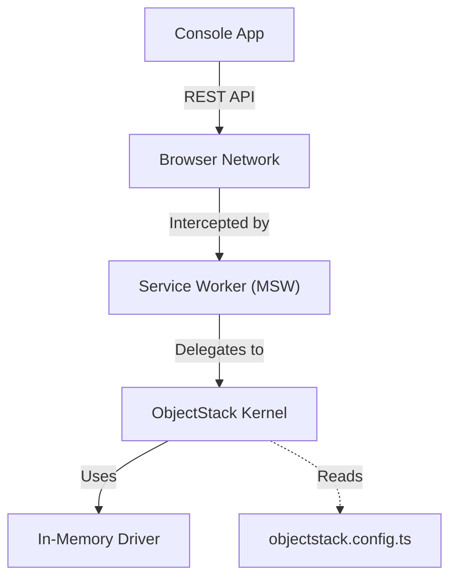
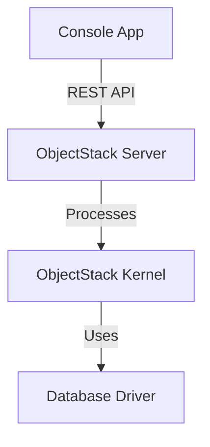

# ObjectStack Studio

The official **ObjectStack Studio** - a metadata-driven admin interface for managing data and configuration.

## 🎯 Overview

ObjectStack Studio provides a modern, responsive admin interface that:

- **Auto-generates UI** from your metadata definitions
- **CRUD Operations** with built-in validation
- **Dynamic Navigation** based on registered objects
- **Real-time Updates** with optimistic UI patterns
- **Dark Mode Support** via shadcn/ui theming

## 🏗️ Architecture

The console supports two runtime modes:

### MSW Mode (Default)

Runs the ObjectStack Runtime directly in the browser using MSW (Mock Service Worker), enabling full offline development.



### Server Mode

Connects to a real ObjectStack server for production use or integration testing.



## 🚀 Quick Start

```bash
# Install dependencies
pnpm install

# Start development server (MSW mode)
pnpm dev

# Start in server mode (connects to real backend)
VITE_RUNTIME_MODE=server VITE_SERVER_URL=http://localhost:5000/api/v1 pnpm dev
```

The console will be available at `http://localhost:3000`.

## ⚙️ Environment Variables

| Variable | Default | Description |
|----------|---------|-------------|
| `VITE_RUNTIME_MODE` | `msw` | Runtime mode: `msw` or `server` |
| `VITE_SERVER_URL` | `http://localhost:5000/api/v1` | Server URL (server mode only) |

Copy `.env.example` to `.env.local` to customize:

## 📁 Project Structure

```
apps/studio/
├── src/
│   ├── App.tsx              # Main application component
│   ├── main.tsx             # Entry point with MSW bootstrap
│   ├── index.css            # Tailwind CSS configuration
│   ├── components/
│   │   ├── app-sidebar.tsx  # Dynamic navigation sidebar
│   │   ├── site-header.tsx  # Page header with breadcrumbs
│   │   ├── ObjectDataTable.tsx  # Auto-generated data tables
│   │   ├── ObjectDataForm.tsx   # Auto-generated forms
│   │   └── ui/              # shadcn/ui components
│   ├── hooks/               # Custom React hooks
│   ├── lib/                 # Utilities
│   └── mocks/               # MSW configuration
├── objectstack.config.ts    # Metadata definitions
└── package.json
```

## 🎨 UI Components

Built with [shadcn/ui](https://ui.shadcn.com/) and Tailwind CSS v4:

- **Sidebar** - Collapsible navigation with object list
- **DataTable** - Sortable, filterable data grid
- **DataForm** - Dynamic form generation from field metadata
- **Toast** - Notification system for user feedback

## 🔧 Configuration

The console reads metadata from `objectstack.config.ts`:

```typescript
import { defineStack } from '@objectstack/spec';
import { ObjectSchema, Field } from '@objectstack/spec/data';

export const Account = ObjectSchema.create({
  name: 'account',
  label: 'Account',
  fields: {
    name: Field.text({ label: 'Name', required: true }),
    industry: Field.select({ 
      label: 'Industry',
      options: ['Technology', 'Finance', 'Healthcare']
    }),
  }
});

export default defineStack({
  objects: [Account]
});
```

## 📦 Dependencies

- **React 18** - UI framework
- **Vite** - Build tool
- **Tailwind CSS v4** - Styling
- **shadcn/ui** - Component library
- **MSW** - API mocking for development
- **@objectstack/client** - API client
- **@objectstack/runtime** - In-browser kernel

## 🛠️ Development

```bash
# Type checking
pnpm typecheck

# Run tests
pnpm test

# Build for production
pnpm build

# Preview production build
pnpm preview
```

## 📄 License

MIT - See [LICENSE](../../LICENSE) for details.
