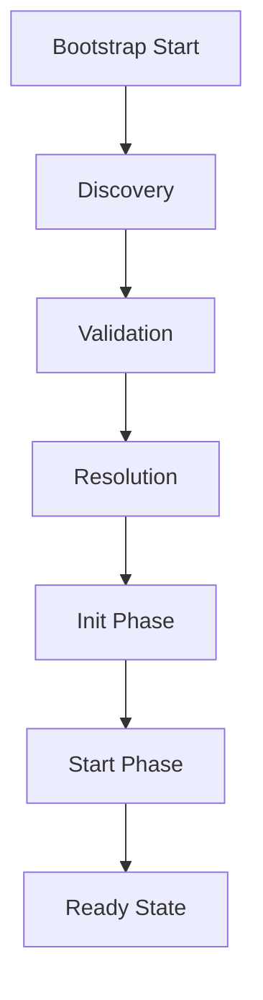

# Core Architecture

The ObjectKernel architecture follows a strict **Life-Cycle** process to ensure system stability.

## The Bootstrap Lifecycle

When you request `kernel.bootstrap()`, the following sequence occurs:



### 1. Discovery Phase
The kernel scans for registered plugins. In a typical app, plugins are explicitly registered via code, but the kernel also supports scanning `package.json` for auto-discovery in certain environments.

### 2. Validation Phase
Each plugin's manifest is validated against the **Plugin Protocol** specific in `@objectstack/spec`.
- **Name**: Must be unique.
- **Version**: SemVer compatible.

### 3. Resolution Phase
The kernel resolves the dependency graph. If Plugin A depends on Plugin B, the kernel ensures Plugin B is loaded first. Circular dependencies are detected and will throw an error.

### 4. Init Phase (`onInit`)
The `onInit` hook is called for all plugins in dependency order. This is where plugins should:
- Register Services involved in Dependency Injection.
- Register Event Listeners.
- **NOT** perform async IO (like database connections) if possible.

### 5. Start Phase (`onStart`)
After all plugins have successfully initialized, the `onStart` hook is called in dependency order. This is where the application "comes alive":
- Database connections are established.
- HTTP servers start listening.
- Background jobs are scheduled.

## IKernel Interface Reference

The `IKernel` is the central orchestrator exposed to the host application.

```typescript
export interface IKernel {
    /**
     * Start the Kernel
     * Initializes and starts all registered plugins and drivers.
     */
    start(): Promise<void>;

    /**
     * Stop the Kernel
     * Gracefully shuts down all plugins.
     */
    stop(): Promise<void>;

    /**
     * Get a Service
     * Retrieves a registered service by ID.
     */
    getService<T>(id: string): T;

    /**
     * Register a Service
     * Manually register a service instance (dynamic registration).
     */
    registerService(id: string, instance: any): void;

    /**
     * Check Service Availability
     */
    hasService(id: string): boolean;
}
```
