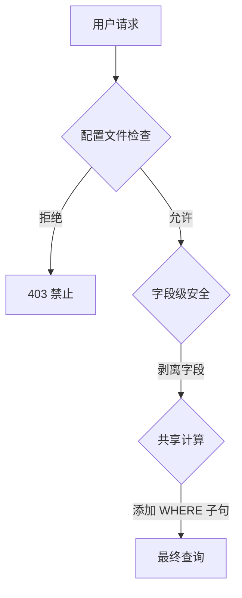

import { ShieldAlert, Users, key, Lock } from 'lucide-react';

# ObjectStack 安全模型："纵深防御"架构

ObjectStack 采用 **"Salesforce 风格"** 的元数据驱动安全模型。之所以选择它而不是 Microsoft（Dataverse）模型，是因为它具有卓越的粒度和解耦性，这对于复杂的企业场景至关重要。

## 1. 主要模型比较

| 层 | ObjectStack / Salesforce | Microsoft Dataverse (Dynamics) | 为什么我们选择 ObjectStack 的方式？ |
| :--- | :--- | :--- | :--- |
| **这是谁？** | **用户 + 身份** | 用户 + Azure AD | 标准 OIDC/SAML 集成。 |
| **他们能做什么？** （功能） | **权限集 / 配置文件** *（布尔标志）* | **安全角色** *（"点阵"）* | 将功能权利（例如，"导出数据"）与数据范围解耦，可以实现更灵活的分配。 |
| **他们坐在哪里？** （层次结构） | **角色** *（报告线）* | **业务单元** *（部门树）* | "角色"意味着逻辑报告（VP 可以看到经理），而"BU"意味着僵化的部门孤岛。 |
| **他们可以看到什么数据？** （可见性） | **共享规则** *（标准和所有权）* | **访问团队** *（临时）* | **共享规则**是"杀手级功能"。它们允许诸如"将 > 100 万的交易与财务共享"之类的逻辑，而 Microsoft 的静态层次结构无法轻松表达。 |
| **超级访问** | **查看全部 / 修改全部** | **组织级别**（绿点） | 将"超级访问"与标准"读取"分开可防止意外数据泄漏。 |

## 2. 协议

该模型通过三个关键协议实现：

### A. 配置文件和权限集
* **什么：** 定义对象和字段的"CRUD"访问权限。
* **类比：** 你的门禁卡。它说"你可以打开 3 层的门"。
* **示例：** `leads: { read: true, edit: false }`。

### B. OWD（组织范围默认值）
* **什么：** 你*不拥有*的记录的基线可见性。
* **类比：** 办公室门的默认状态。它们是锁定的（私有）还是打开的（公共只读）？
* **示例：** `Quote: Private`（只有所有者看到它）。

### C. 共享规则
* **什么：** OWD 的例外，用于开放访问权限。
* **类比：** "如果你是销售副总裁，你可以进入 CEO 的办公室。"
* **示例：** `IF amount > 1,000,000 SHARE WITH Group:Executives READ/WRITE`。

## 3. 执行流程

每个查询都通过**安全内核**。

### A. 功能权限（`src/data/permission.zod.ts`）
定义**基线**。
*   如果 `allowRead = false`，则用户无法看到*任何*记录，无论共享如何。
*   如果 `allowRead = true`，则用户可以看到*他们自己的*记录（所有权）。

### B. 结构层次结构（`src/system/role.zod.ts`）
定义**报告线**。
*   用户被分配到一个角色（例如，"销售经理"）。
*   **自动继承**："销售经理"隐式看到"销售代表"拥有的数据。
*   *注意：这最接近 Microsoft 的"业务单元"概念。*

### C. 数据访问范围（`src/data/sharing.zod.ts`）
定义**扩展**。
*   我们从"私有"（OWD）开始。
*   我们通过**共享规则**扩展访问权限。
    *   **基于标准**："如果状态 = '已发布'，则与所有内部用户共享。"
    *   **基于所有者**："将'西部地区'记录与'西部 VP'共享。"

## 3. 术语映射

如果你来自 Microsoft/Dynamics 生态系统：

*   **安全角色（用户级别）** -> `allowRead: true`
*   **安全角色（BU 级别）** -> `allowRead: true` + `共享规则（与角色共享）`
*   **安全角色（组织级别）** -> `viewAllRecords: true`
*   **业务单元** -> `角色`（功能层次结构）

## 4. 高级：矩阵管理（区域管理）

对于单一报告线（"角色"）不足的大型全球企业，ObjectStack 实现了**区域管理**协议（`src/system/territory.zod.ts`）。

这在不破坏严格角色层次结构的情况下解决了"矩阵组织"问题。

*   **角色层次结构（HR/报告）**："谁向谁报告？"（稳定）
    *   示例：销售代表向销售经理报告。
*   **区域层次结构（市场/收入）**："谁拥有哪个市场？"（灵活，多重分配）
    *   示例：销售代表可能被分配到"西海岸（地理）"和"医疗保健（行业）"。

**工作原理：**
1.  **客户/交易**根据规则分配给**区域**（例如，`State = 'CA'`）。
2.  **用户**被分配给**区域**。
3.  用户可以访问其区域中的记录，*无论*其角色如何。

这与 **Salesforce 企业区域管理**和 **Oracle Sales Cloud** 的最佳实践保持一致。
