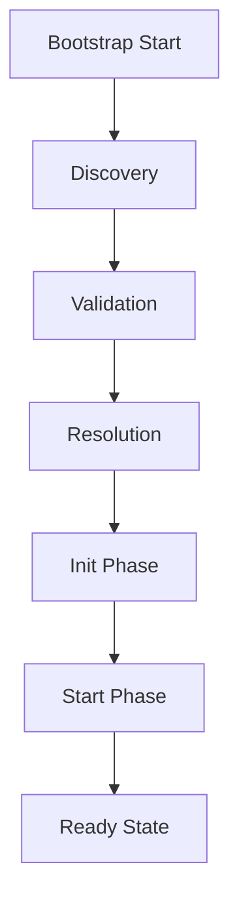

# Core Architecture

The ObjectKernel architecture follows a strict **Life-Cycle** process to ensure system stability.

## The Bootstrap Lifecycle

When you request `kernel.bootstrap()`, the following sequence occurs:



### 1. Discovery Phase
The kernel scans for registered plugins. In a typical app, plugins are explicitly registered via code, but the kernel also supports scanning `package.json` for auto-discovery in certain environments.

### 2. Validation Phase
Each plugin's manifest is validated against the **Plugin Protocol** specific in `@objectstack/spec`.
- **Name**: Must be unique.
- **Version**: SemVer compatible.
- **Dependencies**: Declared dependencies must be present.

### 3. Resolution Phase (Topological Sort)
The kernel builds a dependency graph of all plugins. If Plugin A depends on Plugin B, Plugin B is guaranteed to be initialized first. Circular dependencies will throw a fatal error.

### 4. Init Phase (Synchronous Setup)
The `init(ctx)` hook is called for every plugin in order.
- **Purpose**: Register Services, Validate Configuration.
- **Restriction**: NO side effects (e.g., do not connect to DB, do not start HTTP server).
- **Outcome**: The Service Registry is fully populated.

### 5. Start Phase (Async Execution)
The `start(ctx)` hook is called.
- **Purpose**: Connect to databases, bind network ports, start background jobs.
- **Outcome**: The system is live.

## Error Handling

The Kernel implements a **Rollback Mechanism**. If any plugin fails during the `start` phase, the kernel attempts to stop all previously started plugins in reverse order to ensure a clean exit.

```typescript
const kernel = new ObjectKernel({
    rollbackOnFailure: true, // Default: true
    defaultStartupTimeout: 30000 // 30s timeout per plugin
});
```
