# Field Type Decision Tree

Not sure which field type to use? Follow this decision tree to find the right type for your data, then check the quick-reference table for details.

<Callout type="info">
**Full Details:** Once you've identified the right type, see the [Field Type Gallery](/docs/guides/cheatsheets/field-type-gallery) for complete configuration properties.
</Callout>

---

## Decision Flowchart

```mermaid
flowchart TD
    START([What kind of data?]) --> TEXT{Text?}
    START --> NUM{Number?}
    START --> DATE{Date / Time?}
    START --> CHOICE{Choice / Selection?}
    START --> REL{Relationship?}
    START --> FILE{File / Media?}
    START --> COMP{Computed?}
    START --> STRUCT{Structured Data?}
    START --> AI{AI / ML?}

    %% Text branch
    TEXT -->|Short text| T1[text]
    TEXT -->|Long text| T2[textarea]
    TEXT -->|Rich formatting| T3[richtext]
    TEXT -->|Markdown content| T4[markdown]
    TEXT -->|Email address| T5[email]
    TEXT -->|Website URL| T6[url]
    TEXT -->|Phone number| T7[phone]
    TEXT -->|Secret value| T8[password]

    %% Number branch
    NUM -->|Decimal number| N1[number]
    NUM -->|Whole number| N2[integer]
    NUM -->|Money amount| N3[currency]
    NUM -->|Percentage| N4[percent]
    NUM -->|Star rating| N5[rating]

    %% Date branch
    DATE -->|Date only| D1[date]
    DATE -->|Date + time| D2[datetime]
    DATE -->|Time only| D3[time]

    %% Choice branch
    CHOICE -->|Single choice, dropdown| C1[select]
    CHOICE -->|Multiple choices| C2[multiselect]
    CHOICE -->|Single choice, visible| C3[radio]
    CHOICE -->|Multiple, visible| C4[checkboxes]
    CHOICE -->|On/off switch| C5[toggle]
    CHOICE -->|True/false| C6[boolean]

    %% Relationship branch
    REL -->|Reference another object| R1[lookup]
    REL -->|Parent-child cascade| R2[master_detail]
    REL -->|Self-referencing hierarchy| R3[tree]
    REL -->|Multiple object types| R4[polymorphic]

    %% File branch
    FILE -->|Any file| F1[file]
    FILE -->|Image with preview| F2[image]
    FILE -->|Multiple files| F3[attachment]

    %% Computed branch
    COMP -->|Calculated value| K1[formula]
    COMP -->|Aggregate children| K2[rollup]
    COMP -->|Auto-incrementing ID| K3[autonumber]

    %% Structured branch
    STRUCT -->|Postal address| S1[address]
    STRUCT -->|GPS coordinates| S2[location]
    STRUCT -->|Color picker| S3[color]
    STRUCT -->|Arbitrary JSON| S4[json]
    STRUCT -->|Sensitive data| S5[encrypted]

    %% AI branch
    AI -->|Vector embedding| A1[vector]
    AI -->|Text embedding| A2[embedding]

    style START fill:#4f46e5,color:#fff
    style T1 fill:#059669,color:#fff
    style T2 fill:#059669,color:#fff
    style T3 fill:#059669,color:#fff
    style T4 fill:#059669,color:#fff
    style T5 fill:#059669,color:#fff
    style T6 fill:#059669,color:#fff
    style T7 fill:#059669,color:#fff
    style T8 fill:#059669,color:#fff
    style N1 fill:#d97706,color:#fff
    style N2 fill:#d97706,color:#fff
    style N3 fill:#d97706,color:#fff
    style N4 fill:#d97706,color:#fff
    style N5 fill:#d97706,color:#fff
    style D1 fill:#7c3aed,color:#fff
    style D2 fill:#7c3aed,color:#fff
    style D3 fill:#7c3aed,color:#fff
    style C1 fill:#dc2626,color:#fff
    style C2 fill:#dc2626,color:#fff
    style C3 fill:#dc2626,color:#fff
    style C4 fill:#dc2626,color:#fff
    style C5 fill:#dc2626,color:#fff
    style C6 fill:#dc2626,color:#fff
    style R1 fill:#0284c7,color:#fff
    style R2 fill:#0284c7,color:#fff
    style R3 fill:#0284c7,color:#fff
    style R4 fill:#0284c7,color:#fff
    style F1 fill:#be185d,color:#fff
    style F2 fill:#be185d,color:#fff
    style F3 fill:#be185d,color:#fff
    style K1 fill:#78716c,color:#fff
    style K2 fill:#78716c,color:#fff
    style K3 fill:#78716c,color:#fff
    style S1 fill:#0d9488,color:#fff
    style S2 fill:#0d9488,color:#fff
    style S3 fill:#0d9488,color:#fff
    style S4 fill:#0d9488,color:#fff
    style S5 fill:#0d9488,color:#fff
    style A1 fill:#6d28d9,color:#fff
    style A2 fill:#6d28d9,color:#fff
```

---

## Quick-Reference Table

### Text Types

| Type | Use When | Example |
|:---|:---|:---|
| `text` | Short single-line input (names, titles) | `first_name`, `title` |
| `textarea` | Multi-line content without formatting | `description`, `notes` |
| `richtext` | Formatted content with HTML/WYSIWYG | `article_body`, `bio` |
| `markdown` | Developer-friendly formatted content | `readme`, `documentation` |
| `email` | Email address with validation | `email`, `contact_email` |
| `url` | Web URL with validation | `website`, `linkedin_url` |
| `phone` | Phone number | `phone`, `mobile` |
| `password` | Secret/masked value (stored encrypted) | `api_key`, `secret` |

### Number Types

| Type | Use When | Example |
|:---|:---|:---|
| `number` | Any decimal number | `price`, `weight`, `score` |
| `integer` | Whole numbers only | `quantity`, `age`, `count` |
| `currency` | Money amounts with currency code | `amount`, `total_price` |
| `percent` | Percentage values (0–100 or 0–1) | `completion`, `discount` |
| `rating` | Star ratings (typically 1–5) | `satisfaction`, `difficulty` |

### Date & Time Types

| Type | Use When | Example |
|:---|:---|:---|
| `date` | Calendar date without time | `birth_date`, `due_date` |
| `datetime` | Full timestamp with timezone | `created_at`, `meeting_start` |
| `time` | Time of day without date | `start_time`, `reminder_time` |

### Choice Types

| Type | Use When | Example |
|:---|:---|:---|
| `select` | Pick one from a dropdown list | `status`, `category` |
| `multiselect` | Pick multiple from a dropdown | `tags`, `skills` |
| `radio` | Pick one, all options visible | `priority`, `size` |
| `checkboxes` | Pick multiple, all visible | `features`, `permissions` |
| `toggle` | On/off switch (UI-friendly boolean) | `is_active`, `notifications` |
| `boolean` | Programmatic true/false | `is_archived`, `email_verified` |

### Relationship Types

| Type | Use When | Example |
|:---|:---|:---|
| `lookup` | Reference another object (soft link) | `assigned_to → user` |
| `master_detail` | Parent-child with cascade delete | `line_item → order` |
| `tree` | Self-referencing hierarchy | `category → category` |
| `polymorphic` | Reference multiple object types | `related_to → task\|project\|user` |

<Callout type="tip">
**lookup vs master_detail:** Use `lookup` when the child can exist independently. Use `master_detail` when deleting the parent should delete all children (e.g., order → line items).
</Callout>

### File & Media Types

| Type | Use When | Example |
|:---|:---|:---|
| `file` | Any single file upload | `contract`, `resume` |
| `image` | Image with preview/thumbnail | `avatar`, `product_photo` |
| `attachment` | Multiple file uploads | `documents`, `screenshots` |

### Computed Types

| Type | Use When | Example |
|:---|:---|:---|
| `formula` | Value calculated from other fields | `full_name = first + last` |
| `rollup` | Aggregate from child records | `total_amount = SUM(items.price)` |
| `autonumber` | Auto-incrementing display ID | `ticket_number: TICK-0001` |

### Structured Data Types

| Type | Use When | Example |
|:---|:---|:---|
| `address` | Postal address with components | `billing_address`, `location` |
| `location` | GPS coordinates (lat/lng) | `office_location`, `delivery_point` |
| `color` | Hex color value with picker | `brand_color`, `label_color` |
| `json` | Arbitrary structured data | `configuration`, `metadata` |
| `encrypted` | Sensitive data at rest | `ssn`, `tax_id` |

### AI & ML Types

| Type | Use When | Example |
|:---|:---|:---|
| `vector` | High-dimensional vector for similarity search | `content_embedding` |
| `embedding` | Text embedding for semantic search | `description_embedding` |

---

## Common Use Case Mapping

Can't find your use case above? Check this table:

| Use Case | Recommended Type | Why |
|:---|:---|:---|
| User's full name | `text` | Short, single-line, no validation needed |
| Blog post body | `richtext` | Needs formatting (bold, links, images) |
| Product price | `currency` | Money needs currency code and decimal handling |
| Task assignee | `lookup` | References a `user` record |
| Invoice line items | `master_detail` | Lines should cascade-delete with the invoice |
| Department hierarchy | `tree` | Self-referencing parent → child |
| Feature flags | `json` | Arbitrary key-value configuration |
| User avatar | `image` | Single image with thumbnail support |
| Support ticket ID | `autonumber` | Auto-incrementing human-readable identifier |
| Total order value | `rollup` | SUM of child line item amounts |
| Discount percentage | `percent` | 0–100 range with `%` display |
| Terms accepted | `boolean` | Simple true/false, no UI toggle needed |
| Search index | `vector` | Used for AI similarity search |
| OAuth token | `encrypted` | Sensitive data stored encrypted at rest |

---

## Decision Summary by Question

| Question | Answer → Field Type |
|:---|:---|
| "Can the user type free text?" | `text`, `textarea`, `richtext`, `markdown` |
| "Is it a number I need to calculate with?" | `number`, `integer`, `currency`, `percent` |
| "Does the user pick from a list?" | `select`, `multiselect`, `radio`, `checkboxes` |
| "Does it reference another record?" | `lookup`, `master_detail`, `tree`, `polymorphic` |
| "Is it a file the user uploads?" | `file`, `image`, `attachment` |
| "Is the value computed automatically?" | `formula`, `rollup`, `autonumber` |
| "Does it have internal structure?" | `address`, `location`, `color`, `json` |
| "Is it sensitive/secret?" | `password`, `encrypted` |
| "Is it for AI/ML?" | `vector`, `embedding` |

<Callout type="info">
**Still unsure?** Start with `text` for strings or `number` for numerics. You can always change the field type later — ObjectStack handles data migration automatically for compatible type changes.
</Callout>
