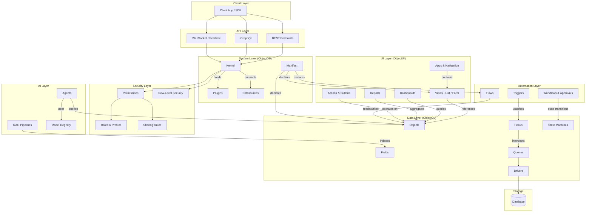
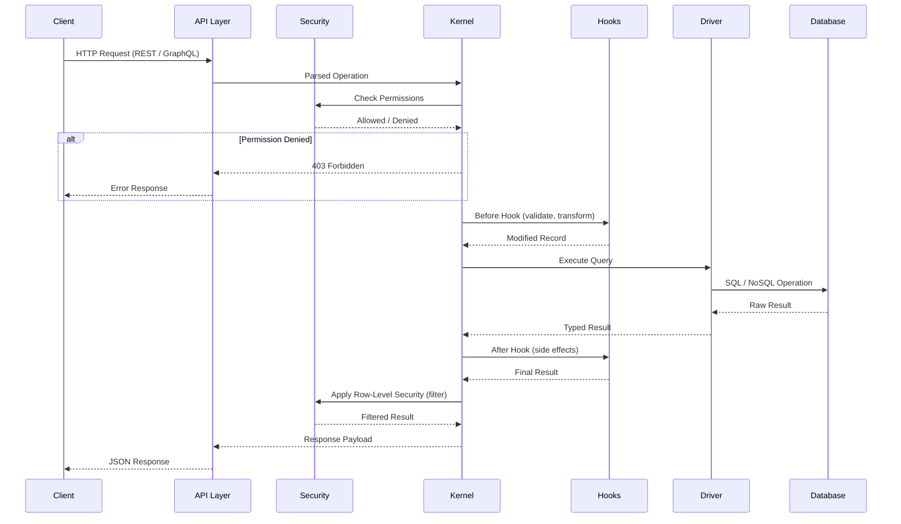
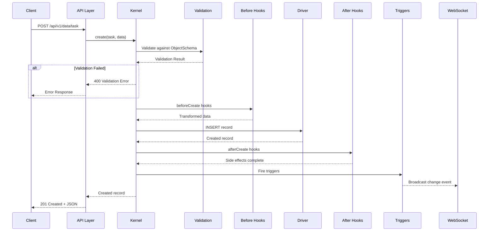
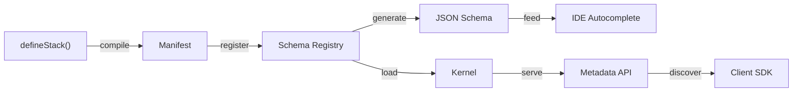

# Protocol Relationship Diagram

ObjectStack is composed of seven protocol layers that work together to form a complete application platform. This page provides visual diagrams showing how these layers connect and how data flows through the system.

<Callout type="info">
**Architecture Principle:** Each layer is defined as pure Zod schemas in `packages/spec/src/`. Layers communicate through well-defined contracts, never by direct coupling.
</Callout>

---

## Layer Overview

| Layer | Package Path | Purpose |
|:---|:---|:---|
| **Data (ObjectQL)** | `src/data/` | Objects, Fields, Queries, Hooks, State Machines |
| **UI (ObjectUI)** | `src/ui/` | Views, Apps, Dashboards, Reports, Actions |
| **System (ObjectOS)** | `src/system/` | Manifest, Datasources, Plugins, Kernel |
| **Automation** | `src/automation/` | Flows, Workflows, Triggers, Approvals |
| **AI** | `src/ai/` | Agents, RAG Pipelines, Model Registry |
| **API** | `src/api/` | REST, GraphQL, WebSocket, Realtime |
| **Security** | `src/security/` | Permissions, Roles, Sharing, RLS |

---

## Protocol Relationship Map

The following diagram shows how each protocol layer references and depends on the others.

<Callout type="tip">
**Key Relationships:**
- **UI → Data:** Views, Dashboards, and Reports reference Objects and Fields by `name`.
- **Automation → Data:** Flows read/write Objects; Workflows drive State Machines; Triggers fire on Hooks.
- **API → Kernel → Data:** All API requests pass through the Kernel, which enforces Security before reaching Data.
- **AI → Data:** Agents query Objects; RAG indexes Field content for retrieval.
</Callout>

---

## Request Flow Diagram

This sequence diagram shows how a typical API request flows through the ObjectStack layers.

---

## Write Flow Detail

The write path includes validation, hook execution, and security enforcement at multiple stages.

---

## Metadata Resolution Flow

How `defineStack()` configuration becomes runtime metadata available to the Kernel and IDE.

| Stage | Description |
|:---|:---|
| `defineStack()` | Developer declares objects, fields, views in `objectstack.config.ts` (array or map format) |
| Manifest | Compiled configuration package with all metadata |
| Schema Registry | In-memory registry of all object and field definitions |
| JSON Schema | Generated JSON Schema files for IDE validation |
| Kernel | Runtime engine that serves data using registered schemas |
| Metadata API | `GET /api/v1/meta/objects` endpoint for client discovery |

---

## Layer Dependency Rules

These rules ensure clean architecture and prevent circular dependencies.

| Rule | Description |
|:---|:---|
| **Data is foundational** | All other layers depend on Data; Data depends on nothing |
| **UI is presentation-only** | UI references Data objects by name but contains no business logic |
| **Security is cross-cutting** | Enforced at the Kernel level, transparent to other layers |
| **Automation is reactive** | Automation responds to Data events; it does not define data structures |
| **AI is a consumer** | AI reads from Data and Automation; it can trigger Flows but not bypass Security |
| **API is a gateway** | API exposes Kernel operations; it never accesses Drivers directly |
| **System is the orchestrator** | Manifest and Kernel wire all layers together at boot time |

<Callout type="info">
**See also:**
- [Data Flow Guide](/guides/data-flow) for detailed sequence diagrams
- [Kernel Services](/guides/kernel-services) for runtime architecture
- [API Protocol](/references/api/contract) for endpoint contracts
</Callout>
