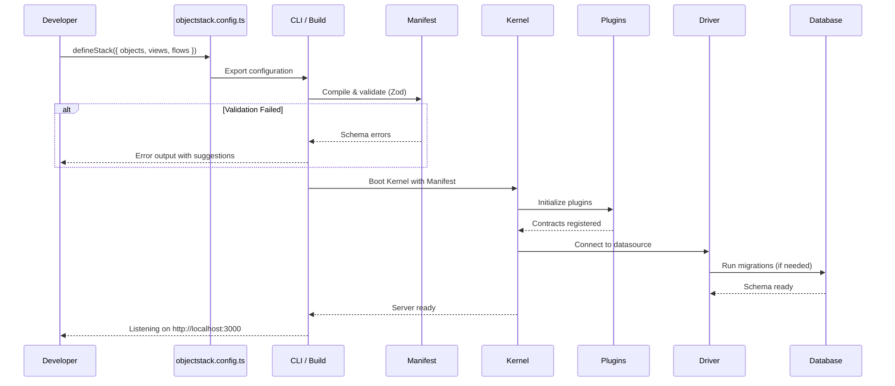
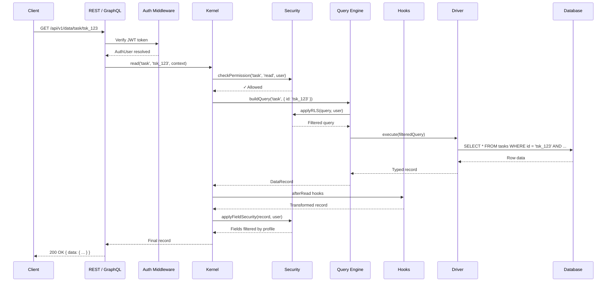
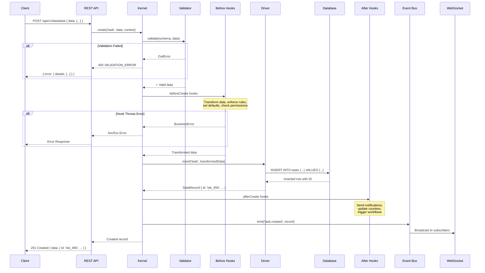
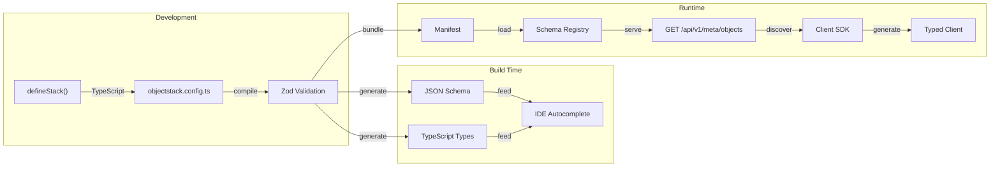
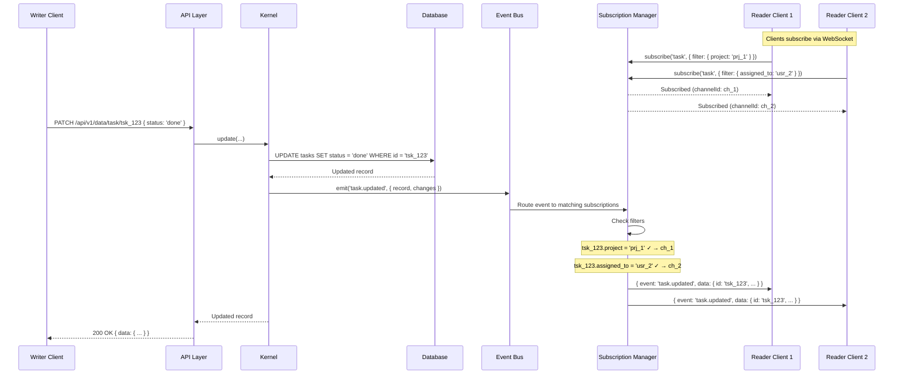
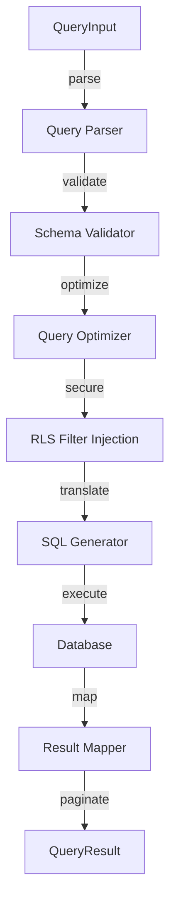

# Data Flow Diagrams

This guide provides detailed diagrams showing how data moves through every layer of the ObjectStack system — from developer configuration to database operations and back to the client.

<Callout type="info">
**Architecture Overview:** For a high-level view of how protocol layers connect, see the [Protocol Relationship Diagram](/references/data/protocol-diagram).
</Callout>

---

## 1. Configuration Flow: defineStack() → Database

How your `objectstack.config.ts` becomes a running application.

| Stage | What Happens |
|:---|:---|
| `defineStack()` | Developer declares objects, fields, views, flows in TypeScript |
| Compile | CLI validates all definitions against Zod schemas |
| Manifest | Compiled metadata package containing all configuration |
| Kernel Boot | Kernel loads the manifest and initializes the plugin graph |
| Plugin Init | Each plugin registers its contracts (DataEngine, AuthService, etc.) |
| Driver Connect | Database driver connects and runs any pending migrations |

---

## 2. Read Flow: Client → API → Database → Response

How a GET request for a single record flows through the system.

<Callout type="tip">
**Row-Level Security (RLS):** Security filters are applied at the query level, not after fetching. This means the database only returns rows the user is allowed to see — efficient even on large tables.
</Callout>

---

## 3. Write Flow: Client → Validation → Hooks → Database → Response

How a POST (create) request is processed with full validation and hook execution.

---

## 4. Metadata Flow: defineStack() → IDE Autocomplete

How object definitions flow from configuration to runtime API and IDE tooling.

| Output | Used By | Purpose |
|:---|:---|:---|
| JSON Schema | VS Code, IntelliJ | Autocomplete and validation in `*.object.ts` files |
| TypeScript Types | Plugin developers | Type-safe access to object definitions |
| Manifest | Kernel | Runtime metadata for query validation and execution |
| Metadata API | Client SDK | Dynamic object/field discovery |
| Typed Client | Frontend apps | `client.task.create({ title: '...' })` |

---

## 5. Realtime Flow: Database Change → Client

How data changes propagate to connected clients in real time.

<Callout type="info">
**Subscription Filtering:** The Subscription Manager applies each client's filter server-side. Clients only receive events for records that match their subscription criteria — no over-fetching.
</Callout>

---

## 6. Query Execution Flow

How a structured query is translated to SQL and executed.

| Stage | Description |
|:---|:---|
| **Query Parser** | Parses the JSON `QueryInput` into an AST |
| **Schema Validator** | Verifies field names and operators against the object schema |
| **Query Optimizer** | Reorders filters, selects indexes, applies batch strategies |
| **RLS Filter Injection** | Appends row-level security conditions based on the user's profile |
| **SQL Generator** | Translates the AST to the target database dialect (PostgreSQL, MySQL, SQLite) |
| **Database** | Executes the query and returns raw rows |
| **Result Mapper** | Converts raw rows to typed `DataRecord` objects |
| **Pagination** | Calculates `total`, `hasMore`, `offset` for the response |

---

## 7. Hook Execution Order

The precise order in which hooks fire during each operation.

```mermaid
flowchart TD
    subgraph "Create Operation"
        C1[beforeValidate] --> C2[validate]
        C2 --> C3[afterValidate]
        C3 --> C4[beforeCreate]
        C4 --> C5["DB INSERT"]
        C5 --> C6[afterCreate]
        C6 --> C7[afterCommit]
    end

    subgraph "Update Operation"
        U1[beforeValidate] --> U2[validate]
        U2 --> U3[afterValidate]
        U3 --> U4[beforeUpdate]
        U4 --> U5["DB UPDATE"]
        U5 --> U6[afterUpdate]
        U6 --> U7[afterCommit]
    end

    subgraph "Delete Operation"
        D1[beforeDelete] --> D2["DB DELETE"]
        D2 --> D3[afterDelete]
        D3 --> D4[afterCommit]
    end
```

| Hook | Phase | Can Modify Data? | Can Abort? |
|:---|:---|:---|:---|
| `beforeValidate` | Pre-validation | ✅ Yes | ✅ Yes |
| `validate` | Validation | ❌ No | ✅ Yes |
| `afterValidate` | Post-validation | ✅ Yes | ✅ Yes |
| `beforeCreate/Update` | Pre-persist | ✅ Yes | ✅ Yes |
| `afterCreate/Update/Delete` | Post-persist | ❌ No (record is saved) | ❌ No |
| `afterCommit` | Post-transaction | ❌ No | ❌ No |

<Callout type="tip">
**Side Effects:** Place side effects (emails, notifications, external API calls) in `afterCommit` hooks. These run after the database transaction is committed, so you won't send a notification for a record that was rolled back.
</Callout>
