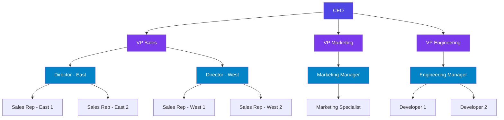
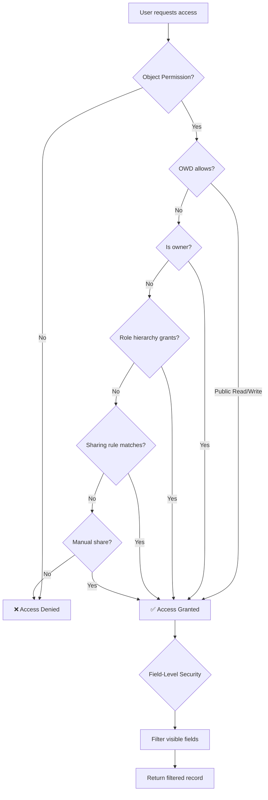

# Security Permissions Matrix

This page provides a comprehensive visual reference for ObjectStack's security model — from object-level permissions to field-level security, sharing rules, and role hierarchies.

<Callout type="info">
**Security Model:** ObjectStack uses a layered security model inspired by Salesforce. Permissions are evaluated in order: Organization-Wide Defaults → Role Hierarchy → Sharing Rules → Record Ownership → Field-Level Security.
</Callout>

---

## 1. Permission Types

ObjectStack defines six core permission types for object access:

| Permission | Code | Description | Grants |
|:---|:---|:---|:---|
| **Read** | `read` | View records owned by the user or shared with them | View own records |
| **Create** | `create` | Create new records | Insert records |
| **Update** | `update` | Modify records owned by the user or shared with them | Edit own records |
| **Delete** | `delete` | Remove records owned by the user or shared with them | Delete own records |
| **View All** | `viewAll` | View all records regardless of ownership or sharing | Read all records |
| **Modify All** | `modifyAll` | Create, update, and delete all records | Full object access |

<Callout type="tip">
**Permission Hierarchy:** `modifyAll` implies `viewAll`, which implies `read`. You don't need to explicitly grant lower permissions when a higher one is set.
</Callout>

---

## 2. Object × Profile Permission Matrix

This matrix shows which permissions each security profile receives on each object. Use this as a template for your own configuration.

### Example: CRM Application

| Object | System Admin | Sales Manager | Sales Rep | Marketing | Read Only |
|:---|:---|:---|:---|:---|:---|
| `account` | `modifyAll` | `viewAll` | `read` `create` `update` | `read` | `read` |
| `contact` | `modifyAll` | `viewAll` | `read` `create` `update` | `read` `create` | `read` |
| `opportunity` | `modifyAll` | `modifyAll` | `read` `create` `update` | `read` | `read` |
| `task` | `modifyAll` | `viewAll` | `read` `create` `update` `delete` | `read` `create` | `read` |
| `report` | `modifyAll` | `read` `create` | `read` | `read` `create` | `read` |
| `user` | `modifyAll` | `read` | `read` | `read` | `read` |
| `audit_log` | `viewAll` | — | — | — | — |

### Configuration Example

```typescript
import { defineStack } from '@objectstack/core';

export default defineStack({
  security: {
    profiles: [
      {
        name: 'sales_rep',
        label: 'Sales Representative',
        objectPermissions: {
          account:     { read: true, create: true, update: true, delete: false, viewAll: false, modifyAll: false },
          contact:     { read: true, create: true, update: true, delete: false, viewAll: false, modifyAll: false },
          opportunity: { read: true, create: true, update: true, delete: false, viewAll: false, modifyAll: false },
          task:        { read: true, create: true, update: true, delete: true,  viewAll: false, modifyAll: false },
        },
      },
      {
        name: 'sales_manager',
        label: 'Sales Manager',
        objectPermissions: {
          account:     { read: true, create: true, update: true, delete: true, viewAll: true,  modifyAll: false },
          contact:     { read: true, create: true, update: true, delete: true, viewAll: true,  modifyAll: false },
          opportunity: { read: true, create: true, update: true, delete: true, viewAll: true,  modifyAll: true  },
          task:        { read: true, create: true, update: true, delete: true, viewAll: true,  modifyAll: false },
        },
      },
    ],
  },
});
```

---

## 3. Field-Level Security (FLS)

Field-level security controls visibility and editability of individual fields per profile.

| Field | System Admin | Sales Manager | Sales Rep | Marketing | Read Only |
|:---|:---|:---|:---|:---|:---|
| `account.name` | Visible, Editable | Visible, Editable | Visible, Editable | Visible | Visible |
| `account.revenue` | Visible, Editable | Visible, Editable | Visible | Hidden | Hidden |
| `contact.email` | Visible, Editable | Visible, Editable | Visible, Editable | Visible | Visible |
| `contact.ssn` | Visible, Editable | Hidden | Hidden | Hidden | Hidden |
| `opportunity.amount` | Visible, Editable | Visible, Editable | Visible, Editable | Visible | Visible |
| `opportunity.margin` | Visible, Editable | Visible | Hidden | Hidden | Hidden |

### FLS States

| State | Can Read? | Can Write? | API Behavior |
|:---|:---|:---|:---|
| **Visible, Editable** | ✅ Yes | ✅ Yes | Field is included in read and accepted in write |
| **Visible, Read-Only** | ✅ Yes | ❌ No | Field is included in read, silently ignored in write |
| **Hidden** | ❌ No | ❌ No | Field is excluded from read and rejected in write |

### Configuration Example

```typescript
{
  name: 'sales_rep',
  fieldPermissions: {
    'account.revenue':       { visible: true,  editable: false },
    'contact.ssn':           { visible: false, editable: false },
    'opportunity.margin':    { visible: false, editable: false },
  },
}
```

---

## 4. Sharing Rule Types

Sharing rules extend access beyond ownership and role hierarchy.

| Rule Type | Description | Example |
|:---|:---|:---|
| **Owner-Based** | Share records based on the record owner's role or group | All accounts owned by "West Region" team are shared with "Sales Directors" |
| **Criteria-Based** | Share records matching specific field conditions | All opportunities with `amount > 100000` are shared with "VP Sales" |
| **Territory-Based** | Share records based on geographic or logical territories | All accounts in "California" territory are shared with "West Coast Team" |
| **Manual** | Individual record sharing granted by the owner or admin | User shares a specific account with a colleague |
| **Apex/Hook** | Programmatic sharing via hooks or custom logic | Share project records with all team members on creation |

### Configuration Example

```typescript
{
  sharing: {
    rules: [
      {
        name: 'high_value_opps_to_vp',
        object: 'opportunity',
        type: 'criteria',
        criteria: {
          field: 'amount',
          operator: 'gte',
          value: 100000,
        },
        sharedWith: { role: 'vp_sales' },
        accessLevel: 'read',
      },
      {
        name: 'west_accounts_to_directors',
        object: 'account',
        type: 'owner',
        ownerRole: 'west_region_rep',
        sharedWith: { role: 'sales_director' },
        accessLevel: 'readWrite',
      },
    ],
  },
}
```

---

## 5. Organization-Wide Defaults (OWD)

OWD sets the baseline access level for each object across the entire organization.

| Default | Read Access | Write Access | Use When |
|:---|:---|:---|:---|
| **Public Read/Write** | All users | All users | Low-sensitivity data (e.g., tasks, wiki pages) |
| **Public Read Only** | All users | Owner + shared | Moderate sensitivity (e.g., accounts, contacts) |
| **Private** | Owner + shared | Owner + shared | High sensitivity (e.g., opportunities, HR records) |
| **Controlled by Parent** | Inherits from parent | Inherits from parent | Child objects in master-detail relationships |

### Configuration Example

```typescript
{
  security: {
    organizationDefaults: {
      account:     'publicReadOnly',
      contact:     'publicReadOnly',
      opportunity: 'private',
      task:        'publicReadWrite',
      hr_record:   'private',
    },
  },
}
```

<Callout type="info">
**Opening Up Access:** OWD restricts the baseline. Sharing rules, role hierarchy, and manual sharing can only **open up** access — never restrict it further than the OWD.
</Callout>

---

## 6. Role Hierarchy

The role hierarchy determines which users can see records owned by users below them.



**How it works:** Each role can see all records owned by users in roles below it. For example:
- **CEO** can see all records in the organization
- **VP Sales** can see records owned by Directors and Sales Reps
- **Director - East** can see records owned by East Sales Reps only
- **Sales Rep** can only see their own records (plus sharing rules)

### Configuration Example

```typescript
{
  security: {
    roles: [
      { name: 'ceo', label: 'CEO', parent: null },
      { name: 'vp_sales', label: 'VP Sales', parent: 'ceo' },
      { name: 'vp_marketing', label: 'VP Marketing', parent: 'ceo' },
      { name: 'director_east', label: 'Director - East', parent: 'vp_sales' },
      { name: 'director_west', label: 'Director - West', parent: 'vp_sales' },
      { name: 'sales_rep', label: 'Sales Representative', parent: 'director_east' },
    ],
  },
}
```

---

## Security Evaluation Order

When a user attempts to access a record, permissions are evaluated in this order:



| Step | Layer | What It Checks |
|:---|:---|:---|
| 1 | **Object Permission** | Does the profile grant any access to this object? |
| 2 | **OWD** | Is the object public? If so, grant access immediately |
| 3 | **Record Ownership** | Does the user own this record? |
| 4 | **Role Hierarchy** | Does the user's role sit above the owner's role? |
| 5 | **Sharing Rules** | Do any sharing rules grant access to this record? |
| 6 | **Manual Sharing** | Was this record explicitly shared with the user? |
| 7 | **Field-Level Security** | Which fields is the user allowed to see/edit? |

<Callout type="tip">
**Performance:** Steps 2–6 are compiled into SQL WHERE clauses (RLS) at query time, not evaluated record-by-record. This ensures security checks are efficient even on tables with millions of rows.
</Callout>
