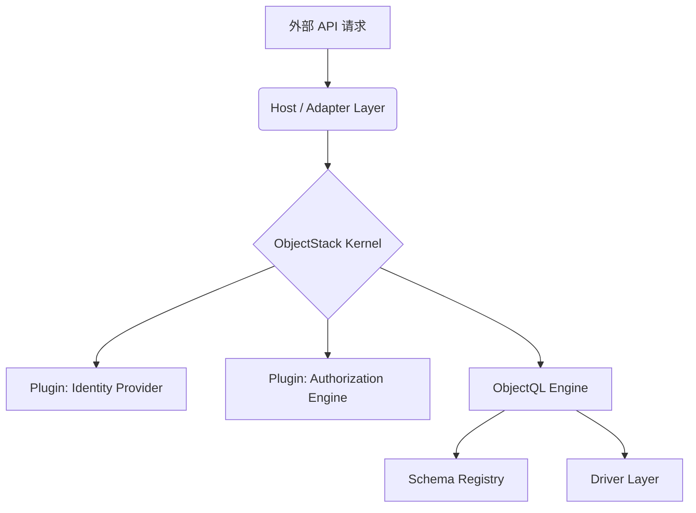

import { Cpu, ShieldCheck, RefreshCw, Zap } from 'lucide-react';

**ObjectOS** 是堆栈的"操作系统"。ObjectQL 处理*数据*，而 ObjectOS 处理*控制*。

它充当位于 API 和数据库驱动程序之间的中间件内核，确保每次数据访问都经过身份验证、授权并符合业务规则。

## 架构组件

*   **Host (Adapter)**: 适配不同的运行环境（Hono/Node, Next.js/Edge, Electron）。
*   **Kernel**: 核心控制器，负责加载插件、管理上下文。
*   **Plugins**: 可插拔的能力模块（如 Auth, Audit, Workflow）。
*   **ObjectQL**: 纯逻辑引擎，负责数据查询解析与验证。
*   **Driver**: 实际的 I/O 执行者。
