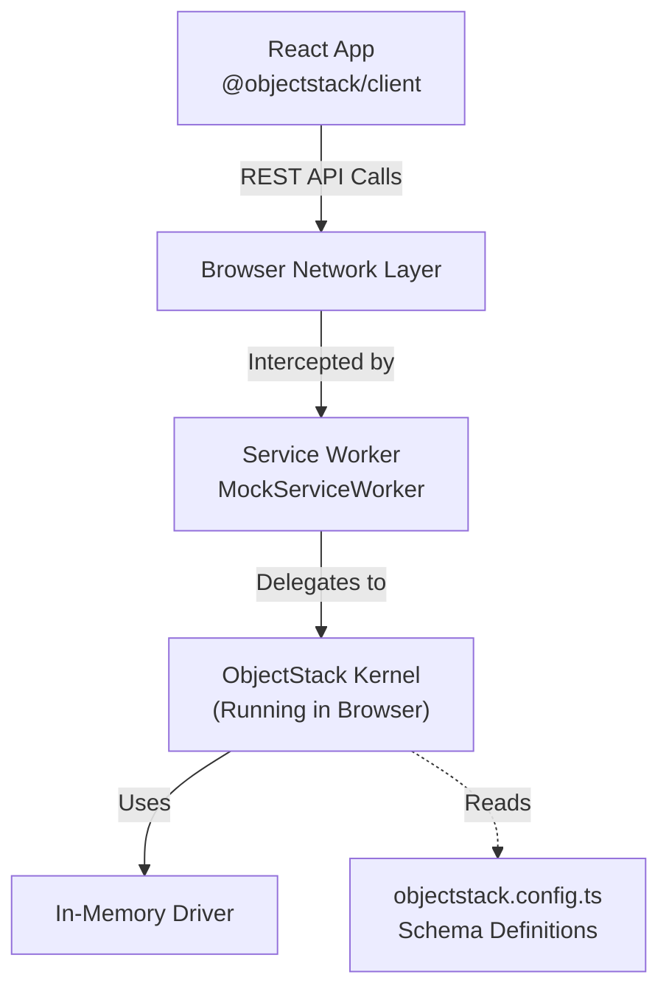

# MSW + React CRUD Example with ObjectStack

This example demonstrates a **Frontend-First** development workflow using **ObjectStack**. 

It runs the entire **ObjectStack Runtime (Kernel)** directly in the browser using a Service Worker. This allows you to develop fully functional React applications with CRUD capabilities, validation, and API interactions **without running a backend server**.

## 🏗️ Architecture

Instead of mocking individual HTTP endpoints manually, this project spins up a real ObjectStack instance inside the browser memory.



## 🎯 Key Features

- **Zero-Backend Development**: Develop the entire frontend flow before the backend exists.
- **Real Logic**: It's not just static JSON. The Kernel enforces schema validation, defaults, and even automation logic.
- **Shared Schema**: The same `objectstack.config.ts` used here can be deployed to the real Node.js server later.
- **Instant Feedback**: Changes to the schema are reflected immediately in the browser.

## 🛠️ Implementation Guide

Here is how to implement this architecture in your own project.

### 1. Define Your Stack

Create an `objectstack.config.ts` to define your data models and application structure.

```typescript
// objectstack.config.ts
import { defineStack } from '@objectstack/spec';

export const TaskObject = {
  name: 'task',
  label: 'Task',
  fields: {
    subject: { type: 'text', required: true },
    priority: { type: 'number', defaultValue: 1 },
    isCompleted: { type: 'boolean', defaultValue: false }
  }
};

export default defineStack({
  objects: [TaskObject]
});
```

### 2. Setup In-Browser Runtime

Create a mock setup file (e.g., `src/mocks/browser.ts`) that initializes the Kernel with the MSW plugin.

```typescript
// src/mocks/browser.ts
import { ObjectKernel, DriverPlugin, AppPlugin } from '@objectstack/runtime';
import { ObjectQLPlugin } from '@objectstack/objectql';
import { InMemoryDriver } from '@objectstack/driver-memory';
import { MSWPlugin } from '@objectstack/plugin-msw';
import myConfig from '../../objectstack.config'; // Your config

export async function startMockServer() {
  // 1. Initialize In-Memory Database
  const driver = new InMemoryDriver();

  // 2. Create the Kernel
  const kernel = new ObjectKernel();
  
  kernel
    .use(new ObjectQLPlugin())                    // Data Engine
    .use(new DriverPlugin(driver, 'memory'))      // Database Driver
    .use(new AppPlugin(myConfig))                 // Load your Schema
    .use(new MSWPlugin({                          // Expose API via Service Worker
      enableBrowser: true,
      baseUrl: '/api/v1'
    }));
  
  // 3. Boot
  await kernel.bootstrap();

  // 4. (Optional) Load Initial Data
  if (myConfig.manifest?.data) {
     // ... logic to seed data into driver ...
  }
}
```

### 3. Initialize Worker on Startup

Update your entry file (`src/main.tsx`) to start the mock server before rendering the React app.

```tsx
// src/main.tsx
import ReactDOM from 'react-dom/client';
import { App } from './App';
import { startMockServer } from './mocks/browser';

async function bootstrap() {
  // Wait for Service Worker to be ready
  await startMockServer();

  ReactDOM.createRoot(document.getElementById('root')!).render(<App />);
}

bootstrap();
```

### 4. Connect Client

In your React components, connect to the mock API (which mimics the real backend URL structure).

```tsx
// src/App.tsx
import { ObjectStackClient } from '@objectstack/client';

// The client thinks it's talking to a real server
const client = new ObjectStackClient({
  baseUrl: '' // Relative path, intercepted by MSW at /api/v1/...
});

await client.connect();
const tasks = await client.data.find('task');
```

### 5. Vite Configuration

If you are using Vite, you may need to optimize dependencies to handle CommonJS packages correctly in the browser.

```typescript
// vite.config.ts
export default defineConfig({
  optimizeDeps: {
    include: [
      '@objectstack/spec',
      '@objectstack/spec/data',
      '@objectstack/spec/system'
    ]
  }
});
```

## 🚀 Running the Example

```bash
# Install dependencies
pnpm install

# Initialize MSW public script (only needed once)
pnpm dlx msw init public/ --save

# Start the dev server
pnpm dev
```

Open `http://localhost:3000`. You can now create, edit, and delete tasks. The data persists in the browser memory as long as you don't refresh (simulate persistence by seeding data in step 2).

## ⚛️ React Hooks (NEW!)

This example now includes **two different approaches** for using ObjectStack in React:

### 1. Traditional Approach (`App.tsx`)
Direct client usage with manual state management:

```tsx
const [tasks, setTasks] = useState([]);
const [loading, setLoading] = useState(true);

useEffect(() => {
  loadTasks();
}, []);

async function loadTasks() {
  setLoading(true);
  const result = await client.data.find('todo_task');
  setTasks(result.value);
  setLoading(false);
}
```

### 2. React Hooks Approach (`AppWithHooks.tsx`)
Declarative data fetching with `@objectstack/client-react`:

```tsx
import { usePagination, useMutation } from '@objectstack/client-react';

function TaskList() {
  const {
    data,
    isLoading,
    page,
    nextPage,
    previousPage
  } = usePagination<Task>('todo_task', {
    pageSize: 10,
    sort: ['priority', '-created_at']
  });

  const { mutate: deleteTask } = useMutation('todo_task', 'delete', {
    onSuccess: () => refetch()
  });

  if (isLoading) return <div>Loading...</div>;
  
  return (
    <div>
      {data?.value.map(task => <TaskItem task={task} />)}
      <button onClick={previousPage}>Previous</button>
      <button onClick={nextPage}>Next</button>
    </div>
  );
}
```

### Switching Between Approaches

Edit `src/main.tsx` and change the `useHooks` flag:

```typescript
const useHooks = false; // Set to true to use React hooks
```

### Available Hooks

From `@objectstack/client-react`:

**Data Hooks:**
- `useQuery` - Query data with automatic caching and refetching
- `useMutation` - Create, update, or delete data
- `usePagination` - Paginated data queries with navigation
- `useInfiniteQuery` - Infinite scrolling / load more

**Metadata Hooks:**
- `useObject` - Fetch object schema/metadata
- `useView` - Fetch view configuration
- `useFields` - Get fields list
- `useMetadata` - Generic metadata queries

**Context:**
- `ObjectStackProvider` - Context provider for ObjectStackClient
- `useClient` - Access ObjectStackClient from context

## 📦 Migration to Production

When you are ready to go to production:

1.  Keep `objectstack.config.ts`.
2.  Deploy the official ObjectStack Server (Node.js).
3.  Point your `ObjectStackClient` `baseUrl` to the real server.
4.  Remove the `startMockServer()` call in `main.tsx`.

No frontend code needs to change!
